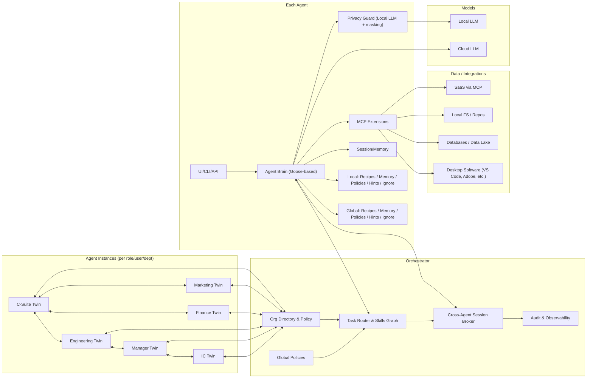

# Architecture One‑Pager

OSS‑first, local‑first orchestrator view — HTTP‑only MVP, OIDC SSO, Vault+KMS, agent pre/post Privacy Guard, metadata-only on controller.

Quick nav: [Docs Home](../README.md) • [Executive Overview](./overview.md)
