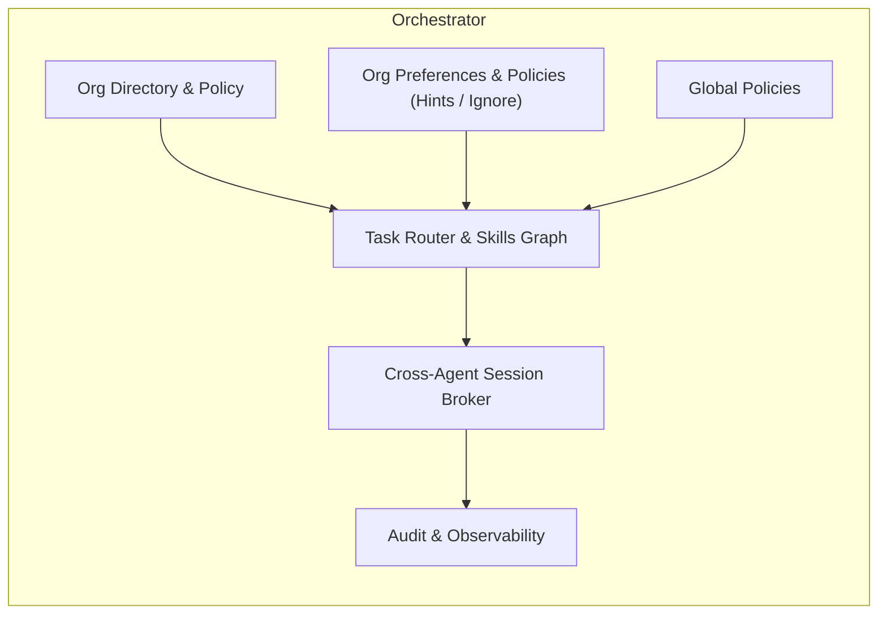

# Orchestrator & Policy

Central services coordinating agents.

```mermaid
flowchart LR
  subgraph Orchestrator["Orchestrator"]
    DIR["Org Directory & Policy"]
    ROUTER["Task Router & Skills Graph"]
    CTX["Cross-Agent Session Broker"]
    AUD["Audit & Observability"]
    ORG_PREFS["Org Preferences & Policies (Hints / Ignore)"]
    GBL_POL["Global Policies"]
  end
  DIR --> ROUTER --> CTX --> AUD
  ORG_PREFS --> ROUTER
  GBL_POL --> ROUTER
```

Quick nav: [Docs Home](../README.md) • [Orchestrator (Minimal)](./orchestrator_min.md) • [Architecture One‑Pager](./one-pager.md)
