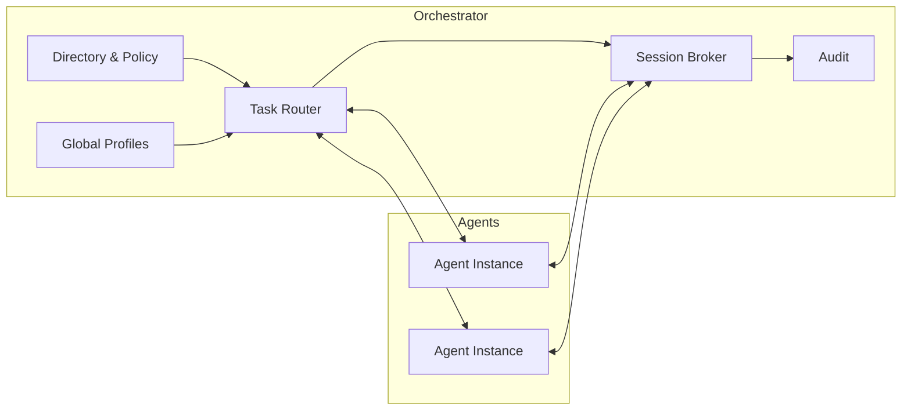

# Orchestrator (Minimal)

Only the concepts needed to read the flow diagrams.

```mermaid
flowchart LR
  subgraph Orchestrator
    DIR[Directory & Policy]
    ROUTER[Task Router]
    CTX[Session Broker]
    AUD[Audit]
    PROF[Global Profiles]
  end

  subgraph Agents
    A1[Agent Instance]
    A2[Agent Instance]
  end

  DIR --> ROUTER --> CTX --> AUD
  PROF --> ROUTER
  A1 <--> CTX
  A2 <--> CTX
  ROUTER <--> A1
  ROUTER <--> A2
```

Quick nav: [Docs Home](../README.md) • [Orchestrator & Policy](./orchestrator.md)
