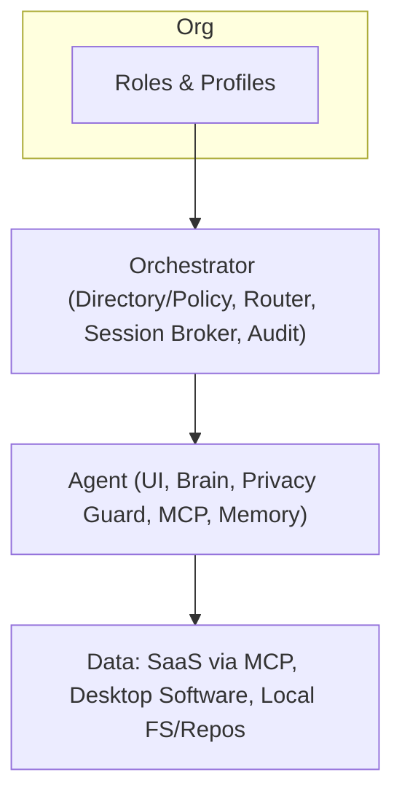

# Executive Overview

Org‑aware, local‑first orchestration — value and outcomes in one screen.

## What it is
- Org‑aware orchestration with role profiles, approvals, and audit
- Local‑first Privacy Guard masks before cloud; minimal data custody
- HTTP‑only MVP with OIDC SSO and Vault OSS + Transit

## Who it’s for
- ICs and Managers (Finance, Marketing, Engineering) — faster, safer workflows
- IT/Platform teams — deploy anywhere with open interfaces
- Compliance/Security — approvals and redacted, exportable audit

## Why it matters
- Reduce privacy/compliance risk: content stays local by default
- Accelerate adoption: org‑relevant assistants, not generic copilots
- Stay portable: standards + adapters prevent vendor lock‑in

Quick nav: [Docs Home](../README.md) • [Architecture One‑Pager](./one-pager.md)
