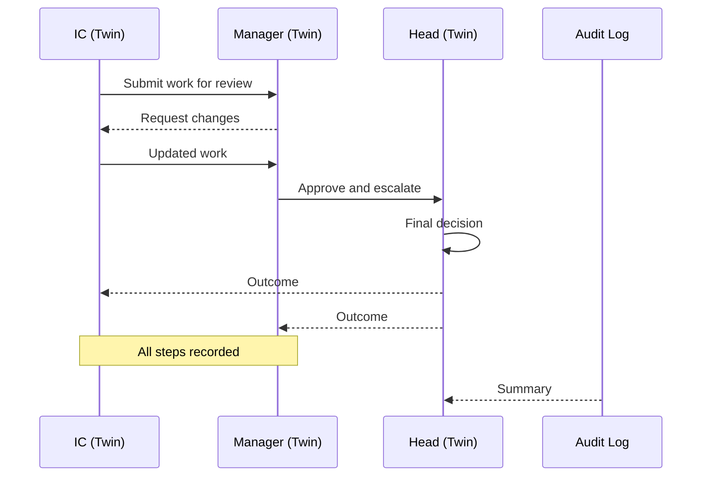

# Flow — Approval Workflow

IC → Manager → Head approvals with audit trail.

```mermaid
sequenceDiagram
  participant IC as IC (Twin)
  participant MG as Manager (Twin)
  participant HD as Head (Twin)
  participant AUD as Audit Log

  IC->>MG: Submit work for review
  MG-->>IC: Request changes
  IC->>MG: Updated work
  MG->>HD: Approve and escalate
  HD->>HD: Final decision
  HD-->>IC: Outcome
  HD-->>MG: Outcome
  Note over IC,MG: All steps recorded
  AUD-->>HD: Summary
```

Quick nav: [Docs Home](../README.md) • [Flow: Task routing](./seq_task_routing.md)
