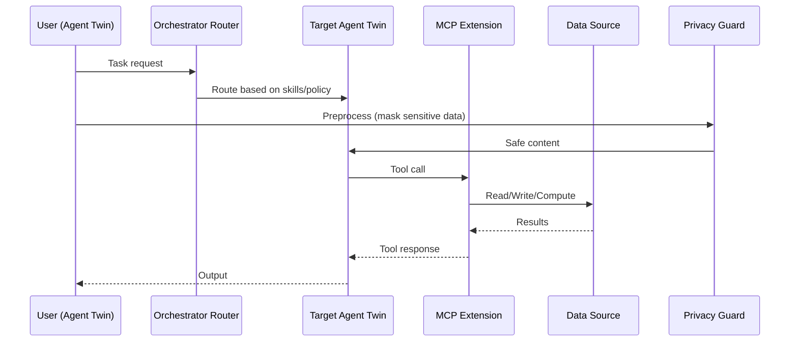

# Flow — Task Routing

How a task is routed to the right Agent Twin.

```mermaid
sequenceDiagram
  participant U as User (Agent Twin)
  participant OR as Orchestrator Router
  participant AT as Target Agent Twin
  participant EX as MCP Extension
  participant DS as Data Source
  participant PG as Privacy Guard

  U->>OR: Task request
  OR->>AT: Route based on skills/policy
  U->>PG: Preprocess (mask sensitive data)
  PG->>AT: Safe content
  AT->>EX: Tool call
  EX->>DS: Read/Write/Compute
  DS-->>EX: Results
  EX-->>AT: Tool response
  AT-->>U: Output
```

Quick nav: [Docs Home](../README.md) • [Flow: Approval](./seq_approval.md)
