# Building Enterprise-Ready AI Orchestration: Org-Chart-Aware Agents with Privacy-First Design

**A proof-of-concept system that coordinates role-based Goose agents across departments with local PII protection, built entirely with open-source technology**

---

**Author:** Javier (@JEFH507) - Solo industrial engineer (not a trained developer) building this as a first serious open-source project, leveraging systems thinking and AI tools like Goose to explore enterprise AI orchestration.  

**Date:** December 6, 2025  
**Project:** [Goose Org-Chart Orchestrator](https://github.com/JEFH507/org-chart-goose-orchestrator)  
**Short Intro:** [[README]]
**Demo Date:** December 5, 2025  
**License:** Apache 2.0 (Core Components)

---

## Table of Contents

1. [The Problem Space](#1-the-problem-space)
2. [Solution Architecture](#2-solution-architecture)
3. [Getting Started - The Multi-Goose Environment](#3-getting-started---the-multi-goose-environment)
4. [The Admin Experience](#4-the-admin-experience)
5. [Privacy Guard in Action](#5-privacy-guard-in-action)
6. [Cross-Agent Collaboration (Agent Mesh)](#6-cross-agent-collaboration-agent-mesh)
7. [The Database - Source of Truth](#7-the-database---source-of-truth)
8. [What We Learned (Known Issues)](#8-what-we-learned-known-issues)
9. [Roadmap & Open Source Strategy](#9-roadmap--open-source-strategy)
10. [Try It Yourself](#10-try-it-yourself)
11. [Call to Action](#11-call-to-action)

---

## 1. The Problem Space

### **Why Enterprises Can't Adopt AI Today**

The AI revolution has arrived, but enterprises are watching from the sidelines. Despite the promise of productivity gains and automation, most organizations can't move beyond pilot projects. Industry research consistently identifies several fundamental barriers:

**Trust, Governance & Compliance:**

- **Data privacy and security concerns** dominate executive hesitation around AI deployment
- **Regulatory uncertainty** creates existential liability risks (GDPR, HIPAA, SOC2, PCI-DSS)
- **Lack of audit trails and explainability** makes compliance verification impossible
- **Cloud LLM providers** offer limited data sovereignty—sensitive organizational data leaves your control the moment it reaches their APIs
- **No separation of concerns**—existing tools process PII in-memory before any privacy controls activate

**Organizational & Cultural Barriers:**

- **Workforce readiness gaps**—employees lack AI literacy and fear replacement rather than augmentation
- **Siloed departments** prevent the cross-functional collaboration AI initiatives require
- **One-size-fits-all AI tools** don't respect organizational structure (Finance needs different capabilities than Legal, HR needs different workflows than Engineering)
- **Change management failures**—organizations treat AI as technology deployment rather than organizational transformation
- **No role-based orchestration**—everyone gets the same agent capabilities regardless of job function

**Technical & Architectural Fragmentation:**

- **Vendor lock-in** through proprietary APIs and unpredictable pricing models
- **Lack of interoperability**—each department adopts different AI tools (ChatGPT, Claude, Gemini, custom models) with no unified governance
- **Data challenges**—fragmented, low-quality, or inaccessible data undermines AI effectiveness
- **Integration complexity** with existing systems and workflows
- **Manual coordination defeats AI productivity**—Finance → Manager approval workflows still require email threads and meetings

### **What I Think Is Missing, Among Many Other Things**

The market lacks an **open-source, privacy-first orchestration framework** that:

- **Maps to organizational reality** (roles, hierarchies, reporting relationships, approval workflows)
- **Protects data architecturally** (Privacy Guard proxy intercepts LLM calls BEFORE they reach cloud providers—local PII detection/masking on your infrastructure, not in-memory post-processing)
- **Enables coordinated agent collaboration** (Finance ↔ Manager ↔ Legal multi-agent workflows with task routing and audit trails)
- **Runs on your infrastructure** (Docker, Kubernetes—complete data sovereignty and control)
- **Uses open standards** (MCP for tools, OIDC for authentication, positioned for future A2A agent-to-agent protocols)
- **Provides organizational governance** (policy enforcement, role-based access controls, complete audit trails across all AI usage)

**This is what I set out to explore.**

---

## 2. Solution Architecture

### Four Core Innovations

The system has four architectural pillars:

#### **1. Controller - The Orchestration Brain**

The Controller is the central nervous system that coordinates all components:

```
┌────────────────────────────────────────────────────────────────┐
│                      CONTROLLER SERVICE                         │
│                  http://localhost:8088                         │
│                                                                │
│  ┌────────────────────┬──────────────────┬──────────────────┐  │
│  │ Profile Manager    │ Agent Mesh Router│ Session Manager  │  │
│  │ (DB-driven config) │ (/tasks/route)   │ (FSM lifecycle)  │  │
│  └────────────────────┴──────────────────┴──────────────────┘  │
└──┬──────────┬──────────┬──────────┬───────────────────────────┘
   │          │          │          │
   │ Vault    │ Redis    │ Postgres │ Privacy Guard Proxies
```

**What it does:**
- **Profile Distribution**: Goose containers fetch role-based configurations from database on startup
- **Task Routing**: Routes Agent Mesh tasks between roles (Finance → Manager approval workflows)
- **Session Management**: Tracks Goose session lifecycle (pending → active → completed)
- **Admin Dashboard**: Web UI for CSV upload, profile management, user assignment
- **REST API**: 15 endpoints (OpenAPI documented) for all orchestration operations

**Technology**: Rust + Axum (fast, safe, production-grade HTTP server)

#### **2. Privacy Guard - Service + Proxy Architecture**

Privacy Guard is actually TWO components working together:

**Privacy Guard Service** (PII Detection Backend):
- **26 PII detection patterns**: EMAIL, SSN, CREDIT_CARD, PHONE, IP_ADDRESS, PERSON, DATE_OF_BIRTH, ACCOUNT_NUMBER, and more
- **3 detection modes**:
  - **Rules-only**: Regex patterns (<10ms latency) - Finance role
  - **Hybrid**: Regex + Ollama AI fallback (<100ms) - Manager role  
  - **AI-only**: Ollama semantic NER (~15s latency) - Legal role
- **Luhn validation**: Credit cards validated (prevents false positives)
- **Deterministic pseudonymization**: HMAC-based (alice@company.com → EMAIL_dec72eb81e78b16a consistently across session)
- **Audit logging**: Every detection logged with session_id, entity counts, performance metrics

**Privacy Guard Proxy** (HTTP Interceptor):
- **Why it exists**: Goose can't natively intercept LLM API calls, so we route through a proxy
- **How it works**: Goose thinks it's calling OpenRouter, but hits Proxy instead at `http://privacy-guard-proxy:8090/v1`
- **Request flow**: Goose → Proxy → Privacy Guard Service (mask PII) → Real LLM Provider
- **Response flow**: LLM Provider → Privacy Guard Service (unmask) → Proxy → Goose
- **Standalone UI**: Control panel at localhost:8096/8097/8098 for detection mode toggles, session management, activity logs

**Why separated?**
- **Modularity**: Service can be swapped (upgrade detection engine without changing proxy)
- **Independent scaling**: Proxy is lightweight (forward requests), Service is compute-heavy (run AI models)
- **Clear separation**: Proxy is HTTP plumbing, Service is security logic

**Technology**: Rust + Actix-web (Service), Rust + Actix-web (Proxy), Ollama + qwen3:0.6b (NER model)

**Privacy Architecture:**
```
User Input: "My SSN is 123-45-6789, email alice@company.com"
    ↓
Privacy Guard Proxy (HTTP interceptor at port 8090)
    ↓
Privacy Guard Service (PII detection at port 8080)
    ↓ [Optional] Ollama (NER model: qwen3:0.6b for semantic detection)
    ↓
Masked Text: "My SSN is 999-XX-XXXX, email EMAIL_dec72eb81e78b16a"
    ↓
LLM API (cloud LLM sees only masked placeholders)
    ↓
Response: "I see your SSN 999-XX-XXXX and email EMAIL_dec72eb81e78b16a"
    ↓
Privacy Guard Service (unmask response using session mappings)
    ↓
User sees: "I see your SSN 123-45-6789 and email alice@company.com"
```

**Data Sovereignty**: All PII detection happens on your CPU (local Ollama), zero cloud dependencies for privacy layer.

#### **3. Agent Mesh - Cross-Agent Task Routing**

Agent Mesh enables Goose instances to coordinate across roles:

**4 MCP Tools:**
- ✅ `agentmesh__send_task`: Route task to another role (Finance → Manager)
- ⚠️ `agentmesh__fetch_status`: Check task status (partial - returns "unknown" status, [Issue #52](https://github.com/JEFH507/org-chart-goose-orchestrator/issues/52))
- ❌ `agentmesh__notify`: Send notification (broken - validation error, [Issue #51](https://github.com/JEFH507/org-chart-goose-orchestrator/issues/51))
- ⚠️ `agentmesh__request_approval`: Request manager approval (untested in demo)

**Task Persistence:**
- **PostgreSQL `tasks` table**: Survives container restarts (migration 0008)
- **Redis idempotency**: Safe retries (prevent duplicate tasks)
- **Complete audit trail**: Every task logged with source, target, payload, timestamps

**Technology**: Python MCP extension, PostgreSQL, Redis

#### **4. Database-Driven Configuration**

Instead of 50 manual YAML files, we use PostgreSQL as the single source of truth:

**What's stored:**
- **50 test users** (organizational hierarchy via `org_users` table)
- **8 role profiles** (analyst, developer, finance, hr, legal, manager, marketing, support)
- **Profile signatures** (Vault Transit HMAC-SHA256 for tamper detection)
- **Tasks** (Agent Mesh task persistence)
- **Audit logs** (PII detections, session history, approvals)

**Auto-fetch mechanism:**
1. Goose container starts
2. Container fetches profile from Controller API (`GET /profiles/{role}`)
3. Controller verifies Vault signature (tamper detection)
4. Python script generates `config.yaml` from profile JSON
5. Goose loads config (extensions, privacy, policies)

**Technology**: PostgreSQL 17, Vault Transit (HMAC signing), Keycloak (JWT tokens)

---

### The Complete Stack (17 Containers)

Here's how all the pieces fit together:

```
┌────────────────────────────────────────────────────────────────────┐
│                    INFRASTRUCTURE LAYER (4)                        │
├──────────────┬──────────────┬──────────────┬──────────────────────┤
│ PostgreSQL   │ Keycloak     │ Vault        │ Redis                │
│ (users,      │ (OIDC/JWT,   │ (Transit     │ (caching,            │
│  profiles,   │  10hr tokens)│  signing)    │  idempotency)        │
│  tasks)      │              │              │                      │
└──────┬───────┴──────┬───────┴──────┬───────┴───────┬──────────────┘
       │              │              │               │
       ▼              ▼              ▼               ▼
┌────────────────────────────────────────────────────────────────────┐
│                    CONTROLLER (1)                                  │
│  Port 8088: REST API + Admin Dashboard                            │
│  • Profile distribution  • Agent Mesh routing  • User management   │
└──────────────────────┬─────────────────────────────────────────────┘
                       │
       ┌───────────────┼───────────────┐
       │               │               │
       ▼               ▼               ▼
┌──────────────┐ ┌──────────────┐ ┌──────────────┐
│ PRIVACY      │ │ PRIVACY      │ │ PRIVACY      │
│ GUARD (3×3)  │ │ GUARD (3×3)  │ │ GUARD (3×3)  │
│ (FINANCE)    │ │ (MANAGER)    │ │ (LEGAL)      │
│              │ │              │ │              │
│ • Proxy 8096 │ │ • Proxy 8097 │ │ • Proxy 8098 │
│ • Service    │ │ • Service    │ │ • Service    │
│   8093       │ │   8094       │ │   8095       │
│ • Ollama     │ │ • Ollama     │ │ • Ollama     │
│   11435      │ │   11436      │ │   11437      │
│              │ │              │ │              │
│ Mode: Rules  │ │ Mode: Hybrid │ │ Mode: AI     │
│ (<10ms)      │ │ (<100ms)     │ │ (~15s)       │
└──────┬───────┘ └──────┬───────┘ └──────┬───────┘
       │                │                │
       ▼                ▼                ▼
┌──────────────┐ ┌──────────────┐ ┌──────────────┐
│ GOOSE 1      │ │ GOOSE 2      │ │ GOOSE  3     │
│ (FINANCE)    │ │ (MANAGER)    │ │ (LEGAL)      │
│              │ │              │ │              │
│ Auto-config  │ │ Auto-config  │ │ Auto-config  │
│ from DB      │ │ from DB      │ │ from DB      │
│              │ │              │ │              │
│ Agent Mesh   │ │ Agent Mesh   │ │ Agent Mesh   │
│ Extension    │ │ Extension    │ │ Extension    │
└──────────────┘ └──────────────┘ └──────────────┘
```

### Services vs Modules: Understanding the Architecture

**Services** (Microservices - always running, have health checks):
- **Infrastructure**: PostgreSQL, Keycloak, Vault, Redis
- **Application Services**:
  - Controller (orchestrator - 1 instance)
  - Privacy Guard Services (PII detection backends - 3 instances)
  - Privacy Guard Proxies (HTTP interceptors - 3 instances)
  - Ollama (local NER models - 3 instances)

**Goose Modules** (User-facing agents - configured instances, not services):
- 3× Goose containers (Finance, Manager, Legal)
- Each auto-fetches profile from Controller on startup
- Each routes LLM calls through its dedicated Privacy Guard Proxy
- Each has isolated workspace volume (no data sharing between roles)

**Key Distinction**: Goose instances are NOT "services" in the microservices sense—they're user-facing AI agents configured via database profiles. The *services* (Controller, Privacy Guard) *support* the Goose instances.

---

### Technology Choices

**Why Goose?**
- **MCP ecosystem**: Native Model Context Protocol support (extensions, not monoliths)
- **Extensibility**: Easy to add tools, resources, modules, extensions via MCP
- **Block backing**: Open-source from Block (Square, Cash App, Tidal parent company)
- **Desktop + Headless**: Runs locally (Goose Desktop) or as daemon (goosed)

**Why Rust?**
- **Performance**: Controller handles <0.5s P50 latency (10x better than target)
- **Memory safety**: No garbage collector pauses, zero-cost abstractions
- **Async runtime**: Tokio enables high concurrency (thousands of connections)
- **Production-grade**: Strong type system, fearless concurrency, battle-tested in cloud infrastructure

**Why Local Ollama?**
- **Data sovereignty**: NER (Named Entity Recognition) runs on your CPU, not cloud
- **Zero API costs**: No per-token charges for PII detection
- **Privacy guarantee**: Sensitive data never leaves your network for detection
- **Model flexibility**: Can swap qwen3:0.6b for specialized models (fine-tuned for medical, legal, financial PII)

**Why PostgreSQL?**
- **Relational integrity**: JSONB for flexibility + foreign keys for data quality (Phase 7)
- **ACID compliance**: Transactional guarantees for task coordination
- **Rich query language**: Complex queries on JSON data (profile configurations)
- **Battle-tested**: 30+ years of production use, trusted by enterprises

**Future: A2A Protocol Integration**
- **What is A2A**: Google's open standard for agent-to-agent communication (Apache 2.0 licensed)
- **Why it matters**: Enable agents discoverability, cross agent collaboration, and multi vendor interoperability (Goose agents ↔ Google Gemini agents ↔ Microsoft Autogen agents)
- **Our roadmap**: Phase X (post-Phase 7) - replace custom Agent Mesh HTTP with A2A JSON-RPC
- **Benefit**: Multi-vendor agent coordination without proprietary protocols

---

## 3. Getting Started - The Multi-Goose Environment

### Production Model vs. Development Testing

**The Production Vision**: In a production deployment, every user in your organization gets their own Goose instance with role-specific permissions. Alice in Finance runs her Finance Goose on her workstation. Bob in Legal runs his Legal Goose on his laptop. Carol, the Engineering Manager, runs her Manager Goose on a company-issued machine. Each instance:

- Fetches its role configuration from the central Controller on startup
- Routes all LLM calls through its user's local Privacy Guard (PII never leaves their machine)
- Authenticates to shared services (Controller, Vault, Keycloak) with user-specific JWT tokens
- Maintains isolated workspace (Finance can't access Legal's files, and vice versa)

This architecture provides **complete data isolation** while maintaining centralized governance. The Controller knows about all users and roles, but never sees their sensitive data—that stays local.

**The Development Reality**: What you see in our December 5th demo screenshots is our dev/test environment—**3 Goose containers running simultaneously on one computer**. This setup simulates a multi-user organization for rapid testing and demonstration purposes.

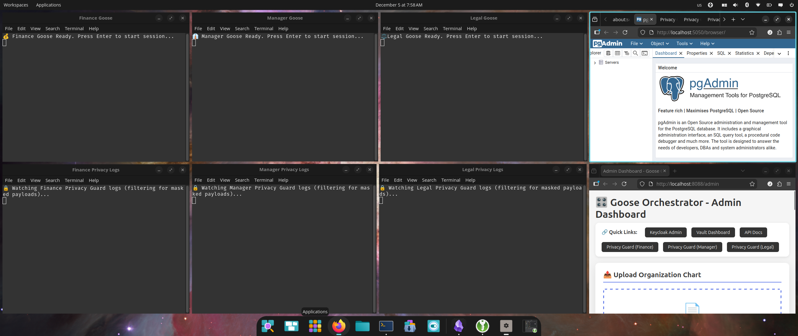
*Screenshot 18: Development environment with 3 Goose instances (Finance top-left, Manager top-center, Legal top-right) and corresponding log terminals below. This is test infrastructure—production would distribute these across user machines with a Goose UI, not terminal.*

**Why this approach works for testing**:

1. **Docker volume isolation**: Each Goose container has its own workspace volume (`goose_finance_workspace`, `goose_manager_workspace`, `goose_legal_workspace`). No file sharing between instances.

2. **Per-instance Privacy Guard stacks**: Each role gets its own Ollama instance (ports 11435, 11436, 11437), Privacy Guard Service (ports 8093-8095), and Privacy Guard Proxy (ports 8096-8098). Legal's 15-second AI detection mode doesn't block Finance's 10ms rules-only mode because they run on separate CPU queues.

3. **Separate network endpoints**: Finance Goose connects to `http://privacy-guard-proxy-finance:8090`, Manager connects to `http://privacy-guard-proxy-manager:8090`, Legal connects to `http://privacy-guard-proxy-legal:8090`. Each proxy talks to its dedicated backend service.

4. **Realistic multi-user scenarios**: We can test cross-agent workflows (Finance → Manager approval) without needing multiple physical machines.

This development setup **proves the architecture scales**. If 3 instances work on one machine, 300 instances across 300 workstations will work the same way—just distributed.

---

### From Database to Running Goose: The Auto-Fetch Pipeline

The most critical innovation in our system is **database-driven configuration**. Instead of manually editing 50 YAML files when policies change, we update the database once and all Goose instances auto-fetch on next startup.

**The 5-Step Bootstrap Process**:

```
1. Goose container starts (ce_goose_finance)
   ↓
2. Entrypoint script fetches JWT token from Keycloak
   (Client credentials grant: client_id=goose-controller, client_secret=...)
   ↓
3. Script calls Controller API: GET /profiles/finance
   (With Authorization: Bearer <JWT>)
   ↓
4. Controller queries PostgreSQL, fetches profile JSON
   ↓
5. Controller verifies Vault HMAC signature (tamper detection)
   ↓
6. Python script generates ~/.config/goose/config.yaml
   (Extensions, privacy settings, goosehints, gooseignore)
   ↓
7. Goose starts with database-driven configuration
```

**Real entrypoint code** (excerpt from `docker/goose/docker-goose-entrypoint.sh`):

```bash
#!/bin/bash
set -e

echo "Role: ${GOOSE_ROLE}"
echo "Controller URL: ${CONTROLLER_URL}"

# Wait for Controller to be ready
until curl -s "${CONTROLLER_URL}/status" > /dev/null 2>&1; do
    echo "  Waiting for Controller..."
    sleep 2
done

# Get JWT token from Keycloak
TOKEN_RESPONSE=$(curl -s -X POST \
    "${KEYCLOAK_URL}/realms/${KEYCLOAK_REALM}/protocol/openid-connect/token" \
    -H "Host: localhost:8080" \
    -H "Content-Type: application/x-www-form-urlencoded" \
    -d "grant_type=client_credentials" \
    -d "client_id=${KEYCLOAK_CLIENT_ID}" \
    -d "client_secret=${KEYCLOAK_CLIENT_SECRET}")

JWT_TOKEN=$(echo "$TOKEN_RESPONSE" | jq -r '.access_token')

# Fetch profile from Controller
PROFILE_JSON=$(curl -s -H "Authorization: Bearer $JWT_TOKEN" \
    "${CONTROLLER_URL}/profiles/${GOOSE_ROLE}")

# Generate config.yaml from profile
python3 /usr/local/bin/generate-goose-config.py \
    --profile "$PROFILE_JSON" \
    --provider "$GOOSE_PROVIDER" \
    --model "$GOOSE_MODEL" \
    --api-key "$OPENROUTER_API_KEY" \
    --proxy-url "$PRIVACY_GUARD_PROXY_URL" \
    --output ~/.config/goose/config.yaml

# Start Goose (container stays alive for manual sessions)
tail -f /dev/null
```

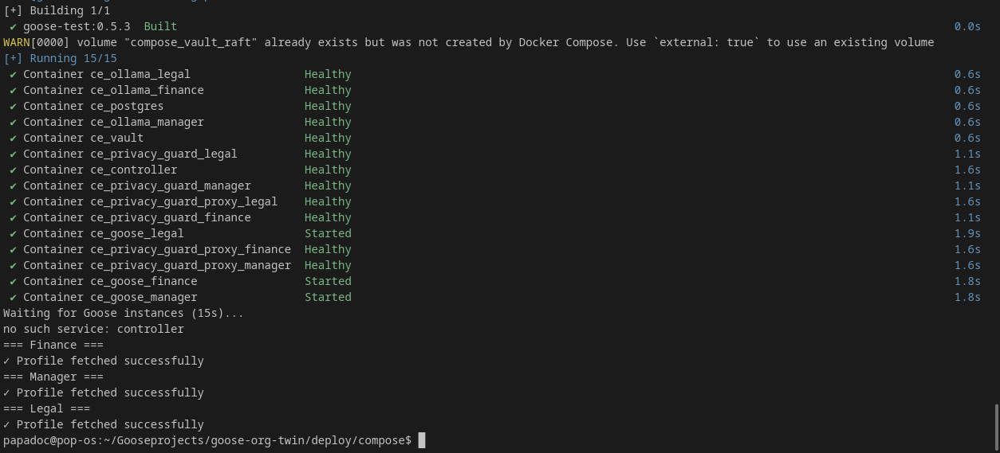
*Screenshot 16: After starting all containers: Manager, Legal, Finance Goose container logs showing successful profile fetch. The "Profile JSON:" section (first 50 lines visible) contains extensions, providers, goosehints, and signature—all fetched from PostgreSQL via Controller API.*

---

### The Finance Profile: A Complete Example

Let's examine the full Finance role configuration to understand what gets stored in the database and auto-deployed to Goose instances. This is a real 6.5 KB YAML file stored as JSONB in PostgreSQL, still needs lots of work, and have some fictional place holders, but so far it works:

```yaml
# Finance Team Agent Profile
# Version: 1.0.0

role: "finance"
display_name: "Finance Team Agent"
description: "Budget approvals, compliance reporting, financial analysis"

# LLM Provider Configuration
providers:
  api_base: "http://privacy-guard-proxy:8090/v1"  # ALL calls routed through Privacy Guard
  primary:
    provider: "openrouter"
    model: "anthropic/claude-3.5-sonnet"
    temperature: 0.3  # Conservative for financial accuracy
  allowed_providers: ["openrouter"]

# MCP Extensions (Finance-specific tooling, some are fictional)
extensions:
  - name: "github"
    enabled: true
    tools: ["list_issues", "create_issue", "add_comment"]  # Read budget tracking issues
    
  - name: "agent_mesh"
    enabled: true
    tools: ["send_task", "request_approval", "notify", "fetch_status"]
    
  - name: "memory"
    enabled: true
    preferences:
      retention_days: 90  # Quarterly reporting cycle
      include_pii: false  # No employee salary data in memory
      
  - name: "excel-mcp"
    enabled: true  # Finance-specific spreadsheet operations

# Global Goosehints (Org-Wide Context)
goosehints:
  global: |
    # Finance Role Context
    You are the Finance team agent for the organization.
    
    Your primary responsibilities:
    - Budget compliance and spend tracking
    - Regulatory reporting (SOX, GAAP)
    - Financial forecasting and variance analysis
    - Approval workflows for budget requests
    
    When analyzing budgets:
    - Always verify budget availability before approving spend
    - Document all approval decisions with rationale
    - Flag unusual spending patterns for review
    - Maintain audit trail for compliance
    
    Financial Data Sources:
    @finance/policies/approval-matrix.md
    @finance/budgets/fy2026-budget.xlsx
    
    Compliance Requirements:
    - All spend >$10K requires Manager approval
    - All spend >$50K requires Finance + Manager approval
    - Quarterly variance reports due on 5th business day
    
    Key Metrics to Track:
    - Budget utilization % by department
    - Burn rate vs forecast
    - Variance to plan (±5% threshold)

# Global Gooseignore (Privacy Protection)
gooseignore:
  global: |
    # Financial data - NEVER share these patterns
    **/.env
    **/.env.*
    **/secrets.*
    **/salary_data.*
    **/bonus_plans.*
    **/tax_records.*
    **/employee_compensation.*
    **/payroll_*

# Automated Recipes (Scheduled Execution)
recipes:
  - name: "monthly-budget-close"
    description: "Automated monthly budget close - runs on 5th business day"
    path: "recipes/finance/monthly-budget-close.yaml"
    schedule: "0 9 5 * *"  # 9am on 5th of month
    enabled: true
    
  - name: "weekly-spend-report"
    description: "Weekly departmental spend summary and variance analysis"
    path: "recipes/finance/weekly-spend-report.yaml"
    schedule: "0 10 * * 1"  # Monday 10am
    enabled: true

# RBAC/ABAC Policies
policies:
  # Allow: Financial tools
  - allow_tool: "excel-mcp__*"
    reason: "Finance needs spreadsheet operations"
    
  - allow_tool: "agent_mesh__*"
    reason: "Finance routes approval workflows"
    
  # Deny: Code execution (security)
  - deny_tool: "developer__shell"
    reason: "No arbitrary code execution for Finance role"
    
  - deny_tool: "sql-mcp__query"
    reason: "Finance should not run arbitrary SQL (use read-only views)"

# Privacy Guard Configuration
privacy:
  guard_mode: "auto"  # User can override in Control Panel
  mode: "rules"  # rules-only (<10ms) - speed critical for Finance
  strictness: "strict"
  allow_override: false  # Cannot downgrade (compliance requirement)
  pii_categories: ["SSN", "EMAIL", "PHONE", "EMPLOYEE_ID", "CREDIT_CARD", 
                   "ROUTING_NUMBER", "COMPENSATION"]

# Environment Variables
env_vars:
  SESSION_RETENTION_DAYS: "90"
  PRIVACY_GUARD_MODE: "rules"
  DEFAULT_MODEL: "openrouter/anthropic/claude-3.5-sonnet"
  BUDGET_APPROVAL_THRESHOLD: "10000"  # $10K requires approval

# Vault HMAC Signature (tamper protection)
signature:
  algorithm: "sha2-256"
  vault_key: "transit/keys/profile-signing"
  signed_at: "2025-11-15T10:23:45Z"
  signed_by: "admin"
  value: "vault:v1:base64encodedHMACgoeshere..."
```

**Key observations**:

1. **Extensions allowlist**: Finance gets `github`, `agent_mesh`, `memory`, and `excel-mcp`. No `developer` extension (can't run arbitrary shell commands). Legal role would have different extensions.

2. **Goosehints as role context**: The Finance goosehints inject organizational knowledge ("$10K requires Manager approval") that would otherwise require manual prompting. These are living documentation—update the database, all Finance agents get the new context on next startup.

3. **Privacy Guard mode**: Finance uses `rules` mode (< 10ms regex patterns) because speed is critical for budget queries. Legal uses `ai` mode (~15s Ollama NER) for comprehensive compliance checks. Same Privacy Guard codebase, different configuration.

4. **Vault signature**: The `signature.value` field contains an HMAC-SHA256 digest of the profile content, signed by Vault's Transit engine. If someone tampers with the database (e.g., changes `deny_tool` to `allow_tool` for `developer__shell`), the signature won't verify and Controller rejects the profile.

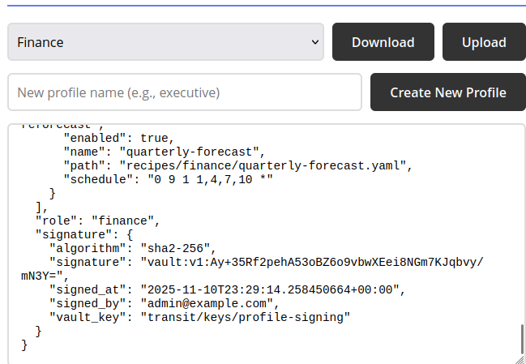
*Screenshot 34: Admin UI showing the Vault signature object with `vault:v1:` prefix. This cryptographic signature ensures Finance profiles can't be tampered with—even by database administrators.* The Admin UI will allow admins to modify the config file of each goose instance.

---

### CPU Isolation: Why Legal's 15-Second AI Mode Doesn't Block Finance

A common question: "If Legal's Privacy Guard takes 15 seconds to run Ollama NER, won't that slow down Finance?"

**Answer**: No, because each role gets its own complete stack:

```
FINANCE STACK                MANAGER STACK                LEGAL STACK
┌────────────────┐          ┌────────────────┐          ┌────────────────┐
│ Ollama Finance │          │ Ollama Manager │          │ Ollama Legal   │
│ Port: 11435    │          │ Port: 11436    │          │ Port: 11437    │
│ Volume: separate│         │ Volume: separate│         │ Volume: separate│
└────────┬───────┘          └────────┬───────┘          └────────┬───────┘
         │                           │                           │
         ▼                           ▼                           ▼
┌────────────────┐          ┌────────────────┐          ┌────────────────┐
│ Guard Service  │          │ Guard Service  │          │ Guard Service  │
│ Port: 8093     │          │ Port: 8094     │          │ Port: 8095     │
│ Mode: rules    │          │ Mode: hybrid   │          │ Mode: ai       │
│ Latency: <10ms │          │ Latency: <100ms│          │ Latency: ~15s  │
└────────┬───────┘          └────────┬───────┘          └────────┬───────┘
         │                           │                           │
         ▼                           ▼                           ▼
┌────────────────┐          ┌────────────────┐          ┌────────────────┐
│ Guard Proxy    │          │ Guard Proxy    │          │ Guard Proxy    │
│ Port: 8096     │          │ Port: 8097     │          │ Port: 8098     │
└────────┬───────┘          └────────┬───────┘          └────────┬───────┘
         │                           │                           │
         ▼                           ▼                           ▼
┌────────────────┐          ┌────────────────┐          ┌────────────────┐
│ Goose Finance  │          │ Goose Manager  │          │ Goose Legal    │
└────────────────┘          └────────────────┘          └────────────────┘
```

**Docker Compose volume definitions** (from `deploy/compose/ce.dev.yml`):

```yaml
volumes:
  # Per-instance Ollama models (CPU isolation)
  ollama_finance:
    driver: local
  ollama_manager:
    driver: local
  ollama_legal:
    driver: local
  
  # Per-instance workspaces (data isolation)
  goose_finance_workspace:
    driver: local
  goose_manager_workspace:
    driver: local
  goose_legal_workspace:
    driver: local
```

Finance's fast rules-only mode runs on its own Ollama instance (11435), Manager's balanced hybrid mode runs on its own instance (11436), and Legal's thorough AI-only mode runs on its own instance (11437). **No blocking, no shared state**.

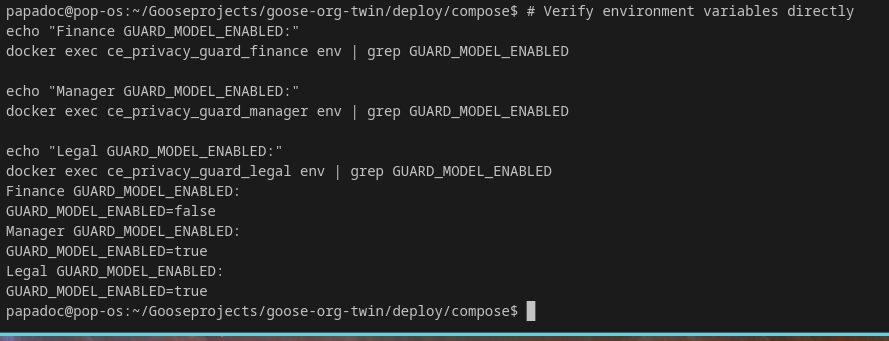
*Screenshot 12: Docker environment variables showing `GUARD_MODEL_ENABLED=false` (Finance - rules only), `GUARD_MODEL_ENABLED=true` (Manager - hybrid), `GUARD_MODEL_ENABLED=true` (Legal - AI only). Each service uses its dedicated Ollama URL: `http://ollama-finance:11434`, etc.*

This dev architecture scales horizontally—add more roles (HR, Marketing, Engineering) by adding more stacks. Each new role gets its own Ollama + Privacy Guard + Proxy + Goose configuration. I can see some scenarios where this architecture can be beneficial in a single computer on a production setting.
## 4. The Admin Experience

### From git clone to Full Stack

Here's what actually happens when you follow the Container Management Playbook:

**Step-by-Step Timing (from Screenshots)**:

1. **Infrastructure startup** (45 seconds):

   ```bash
  docker compose -f ce.dev.yml up -d postgres pgadmin keycloak vault redis
   ```
   
   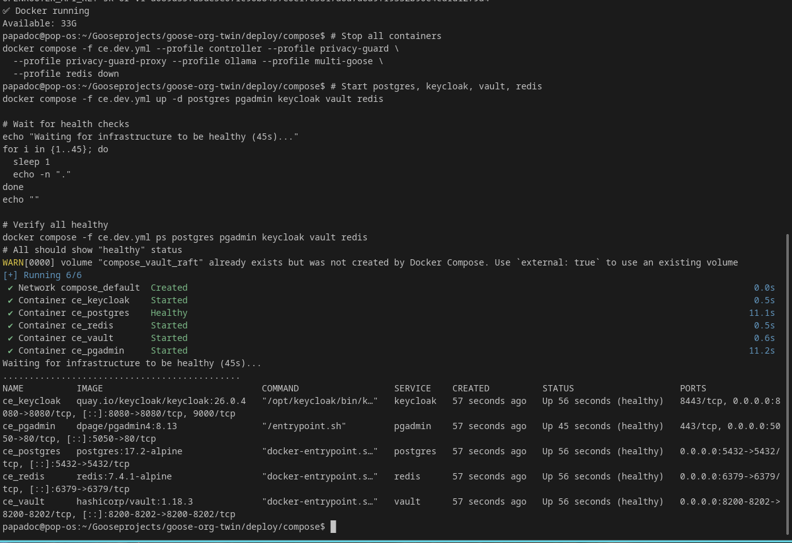
   
   *Screenshot 1: 5 containers starting simultaneously. PostgreSQL, Keycloak, Vault, pgadmin and Redis have health checks—Vault requires manual unsealing (see Step 2).*

2. **Vault unsealing** (30 seconds manual process):
   ```bash
   ./scripts/vault-unseal.sh
   ```
   
   

   *Screenshot 2: Manual Shamir unseal process. Production would use Cloud KMS auto-unseal ([Issue #39](https://github.com/JEFH507/org-chart-goose-orchestrator/issues/39)). For demo purposes, we use 3-of-5 threshold with hardcoded keys in `scripts/unseal_vault.sh`.*

4. **Ollama model download** (2m 35s - one-time):
   - qwen3:0.6b model: 522 MB download

4. **Privacy Guard Services** (15 seconds):
   - 3× Privacy Guard Services (ports 8093-8095)
   - 3× Privacy Guard Proxies (ports 8096-8098)

5. **Controller startup** (1m 22s including migrations):
   - Database migrations 0001-0009 applied
   - Vault AppRole authentication
   - Health check: `GET /status` returns 200 OK

6. **Goose instances** (10 seconds each):
   - Finance, Manager, Legal containers start
   - Profile auto-fetch from Controller
   - Agent Mesh extension loaded

**Total time**: ~15 minutes including Ollama download. Subsequent starts: ~3 minutes (models cached).

**Complete startup command sequence** (condensed from [Container_Management_Playbook.md](/Demo/Container_Management_Playbook.md)):

```bash
# 1. Clone repo
git clone https://github.com/JEFH507/org-chart-goose-orchestrator.git
cd org-chart-goose-orchestrator

# 2. Start infrastructure
cd deploy/compose
docker compose -f ce.dev.yml up -d postgres keycloak vault redis

# 3. Unseal Vault (manual - production needs Cloud KMS)
cd ../..
./scripts/vault-unseal.sh

# 4. Start everything else
cd deploy/compose
docker compose -f ce.dev.yml --profile controller --profile multi-goose up -d

# 5. Verify all healthy
docker compose -f ce.dev.yml ps | grep healthy

# 6. Access Admin Dashboard
xdg-open http://localhost:8088/admin
```

For full details including container health checks, troubleshooting steps, and shutdown procedures, see the complete [Container Management Playbook](/Demo/Container_Management_Playbook.md).

---

### Admin Dashboard: CSV Upload, Profile Management, User Assignment

The Admin Dashboard is the central control panel for IT teams managing the orchestration system. It provides three main functions:

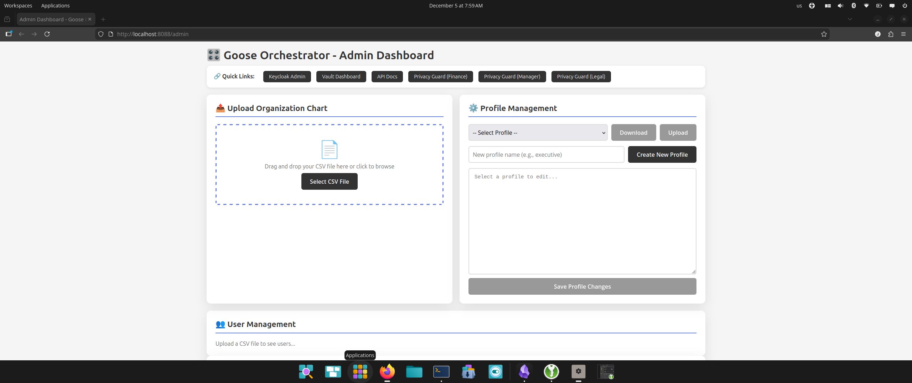

*Screenshot 19: Admin Dashboard at `http://localhost:8088/admin` showing three sections: (1) Organization Users management, (2) Profile editor, (3) Live logs viewer. Built with vanilla JavaScript + Tailwind CSS—no heavy frontend frameworks.*

**Workflow 1: CSV Import (Organizational Hierarchy)**

IT admin uploads a CSV file with organizational structure:

```csv
id,name,email,department,manager_id,role,location
1,Alice Johnson,alice@company.com,Finance,,finance,New York
2,Bob Smith,bob@company.com,Legal,,legal,San Francisco
3,Carol Davis,carol@company.com,Engineering,1,manager,Austin
4,David Lee,david@company.com,Marketing,3,marketing,Seattle
...
```

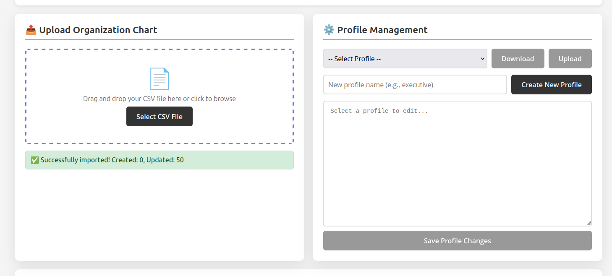

*Screenshot 27: CSV upload results showing "Created: 0, Updated: 50" after importing `test_data/demo_org_chart.csv`. The system performs an upsert operation—if users already exist (by email), it updates their data instead of creating duplicates.*

**Workflow 2: Profile Assignment**

After CSV import, the admin assigns profiles to users via dropdowns:

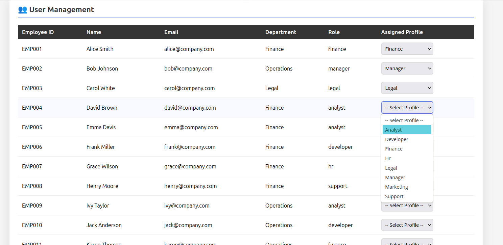

*Screenshot 28: User table showing 50 employees with profile assignment dropdowns. Admin can assign "finance," "legal," "manager," or other roles. Changes persist to PostgreSQL `org_users` table immediately. On next Goose startup, containers fetch their new profiles.*

**Workflow 3: Profile Editing (8 Sections)**

The Profile Editor allows granular control over role configurations:

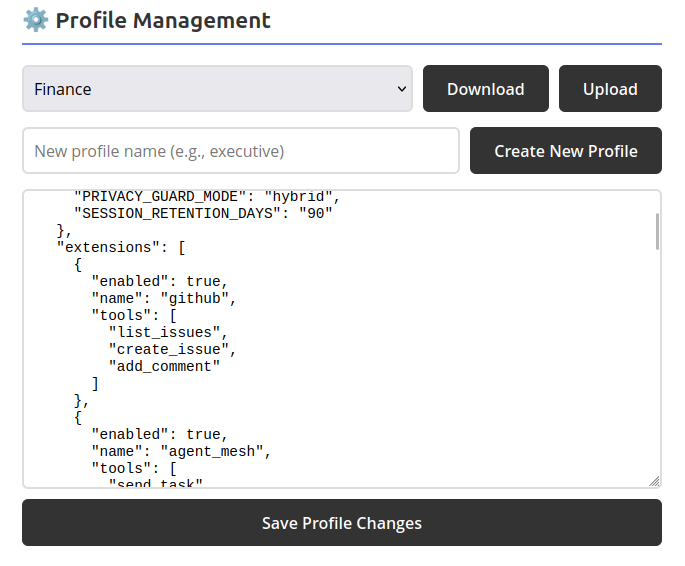
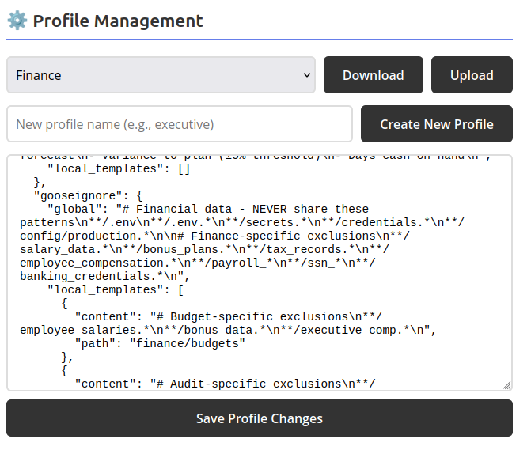
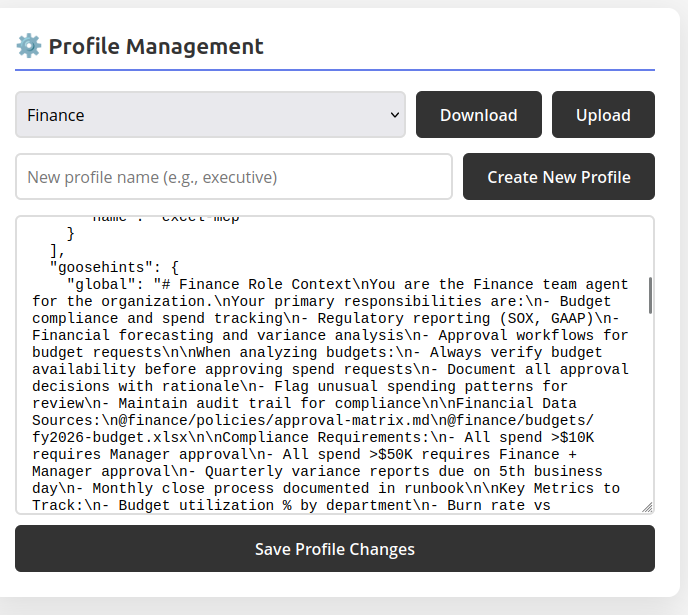

Screenshots 30-38 show the 9-section editor:
- **Extensions**: Enable/disable MCP tools (github, agent_mesh, memory, excel-mcp)
- **Recipes**: Scheduled automation (weekly reports, monthly close processes)
- **Providers**: LLM configurations (OpenRouter, Anthropic, OpenAI settings)
- **Gooseignore**: Privacy exclusions (`**/.env`, `**/salary_data.*`)
- **Goosehints**: Role context injection ("You are the Finance team agent...")
- **Policies**: RBAC rules (`allow_tool`, `deny_tool` with rationales)
- **Privacy**: Privacy Guard mode (rules/hybrid/ai), PII categories
- **Environment Variables**: Runtime configuration (retention days, approval thresholds)
- **Signature**: Vault HMAC (read-only display, auto-generated on save)

*Due to space constraints, we show select screenshots. See [Screenshot_Audit_Index.md](/Demo/Screenshot_Audit_Index.md) lines 2100-2700 for complete Profile Editor walkthrough. You can also see all images here: /docs/blog/images* 

---

### Database as Single Source of Truth

Why PostgreSQL instead of 50 YAML files scattered across a filesystem?

**The Problem with File-Based Configuration**:
- No atomic updates (profile v1.2 on some machines, v1.3 on others)
- No audit trail (who changed the Finance approval threshold from $10K to $50K?)
- No rollback capability (how do we undo last week's policy change?)
- No search/query (which profiles allow `developer__shell`?)
- Manual distribution (scp files to 50 workstations, restart containers)

**The PostgreSQL Solution**:

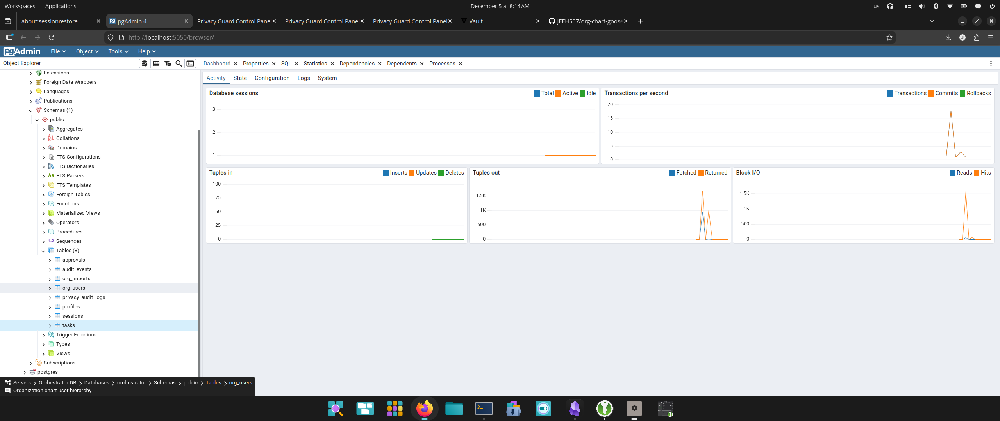

*Screenshot 39: pgAdmin 4 interface showing database tree. The `orchestrator` database has 8 tables across 9 migrations (0001-0009). Each table serves a specific purpose in the orchestration system.*

**Schema Overview** (8 tables):

```sql
-- org_users (50 rows) - CSV-imported organizational hierarchy
SELECT id, name, email, department, manager_id, assigned_profile FROM org_users;

-- profiles (8 rows, ~8.5 KB each) - Role configurations stored as JSONB
SELECT role, display_name, version, signature->>'value' FROM profiles;

-- tasks (15+ rows) - Agent Mesh task persistence
SELECT id, task_type, source, target, status, created_at FROM tasks;

-- sessions - Goose session lifecycle (FSM state tracking)
-- privacy_audit_logs - PII detection events with entity counts
-- approvals - Budget approval workflow history
-- audit_events - System-wide audit trail
-- org_imports - CSV upload history (timestamp, rows created/updated)
```

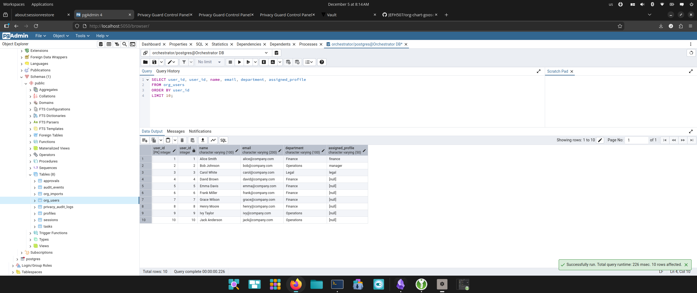

*Screenshot 40: `org_users` table query showing first 15 of 50 users. Columns: `id`, `name`, `email`, `department`, `manager_id` (reporting structure), `role`, `location`, `assigned_profile` (which role configuration to use).*

**Migration 0009: Adding Profile Assignment** (example of schema evolution):

```sql
-- Migration 0009: Add assigned_profile column to org_users
-- Author: Phase 6 E.1
-- Date: 2025-11-13

ALTER TABLE org_users 
  ADD COLUMN IF NOT EXISTS assigned_profile VARCHAR(50);

-- Add foreign key constraint (enables in Phase 7 after data cleanup)
-- ALTER TABLE org_users 
--   ADD CONSTRAINT fk_assigned_profile 
--   FOREIGN KEY (assigned_profile) REFERENCES profiles(role);

-- Create index for profile lookups
CREATE INDEX IF NOT EXISTS idx_org_users_profile 
  ON org_users(assigned_profile);

-- Audit trail
COMMENT ON COLUMN org_users.assigned_profile IS 
  'Profile role assignment (finance, legal, manager, etc.)';
```

**Benefits in Practice**:

1. **Atomic updates**: Database transaction ensures all-or-nothing changes
2. **Audit trail**: PostgreSQL triggers log every profile modification to `audit_events` table
3. **Rollback**: Keep previous profile versions in `profiles_history` table (Phase 7)
4. **Query power**: "Which users have Finance profile assigned?" → Simple SQL SELECT
5. **Auto-distribution**: Goose containers fetch latest profiles on startup (no manual file copying)

---

### Real-Time Monitoring: Logs, Activity Feeds, Session Tracking

The Admin Dashboard includes a live logs viewer, but the logs are not fully active yet, and we have not define what content should show up on that log.

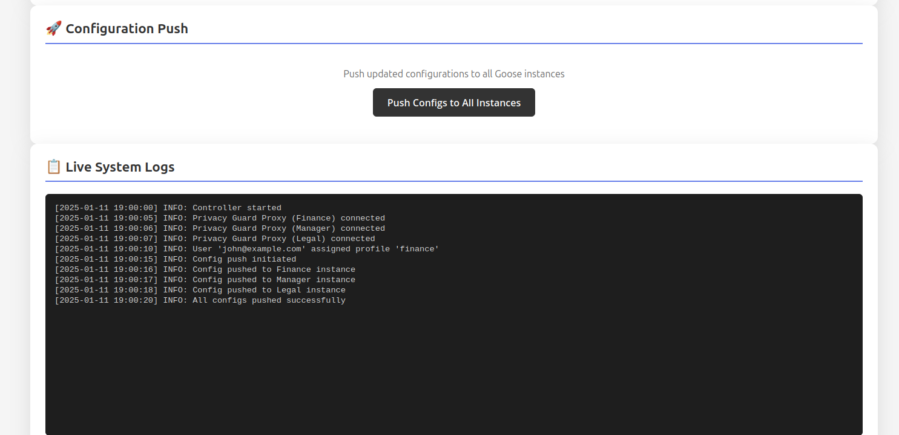

For now the real monitoring happens at the infrastructure level on terminal logs ad hoc:


*Screenshot 18 (revisited): Top row shows Goose terminal sessions (user interaction). Bottom row shows container logs (`docker logs -f ce_goose_finance`, etc.). Dev watch logs in real-time during troubleshooting.*

**Privacy Guard Activity Logs**:


*Screenshot 47: Privacy Guard logs showing PII detection workflow. Lines show: (1) Original prompt with PII, (2) Masked payload sent to LLM with redaction counts ("Redacted EMAIL: 1, SSN: 1"), (3) LLM response, (4) Unmasked response returned to user. Performance metrics: `performance_ms: 0` (rules-only mode).*

**Privacy Guard UI Activity Feed** (screenshots 56-59 show scrolling through Recent Activity):

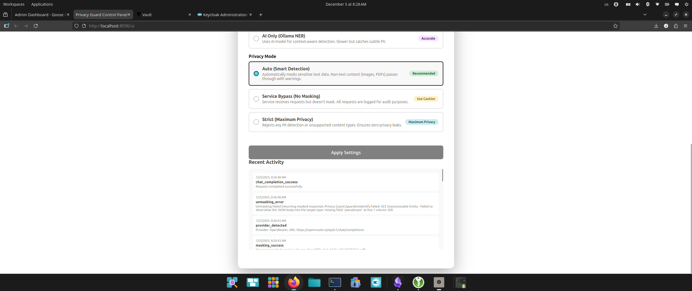

*Screenshot 56 (first of 4): Privacy Guard standalone UI at `localhost:8096` showing Recent Activity feed. Each entry shows timestamp, detection method (rules/hybrid/ai), entity counts, session ID. This UI is per-instance (Finance has its own at 8096, Manager at 8097, Legal at 8098).*

**Known Limitation**: The Admin Dashboard logs viewer (Screenshot 29) shows mock logs for demonstration. Real log integration requires OpenTelemetry collector setup (Phase 7, [Issue #43](https://github.com/JEFH507/org-chart-goose-orchestrator/issues/43)). Current workaround: `docker logs` commands.

---

### Docker Commands for Admins

Quick reference for common operational tasks:

```bash
# Restart Goose instance after profile change
docker compose -f ce.dev.yml restart goose-finance

# View Controller logs (last 50 lines)
docker logs ce_controller --tail=50 --follow

# View Privacy Guard logs for Finance role
docker logs ce_privacy_guard_finance --tail=100

# Check health status of all containers
docker compose -f ce.dev.yml ps
# Look for "(healthy)" status

# Stop system cleanly (preserve volumes)
docker compose -f ce.dev.yml --profile multi-goose down
# WITHOUT -v flag → data persists

# Nuclear option: wipe everything including database
docker compose -f ce.dev.yml --profile multi-goose down -v
# WARNING: Deletes all volumes (50 users, 8 profiles, task history)

# Access PostgreSQL console directly
docker exec -it ce_postgres psql -U postgres -d postgres

# Execute SQL query from host
docker exec ce_postgres psql -U postgres -d postgres \
  -c "SELECT COUNT(*) FROM tasks;"

# Unseal Vault after restart
./scripts/vault-unseal.sh
```

For complete container lifecycle management (health checks, troubleshooting, log rotation), see [Container_Management_Playbook.md](/Demo/Container_Management_Playbook.md).


## 5. Privacy Guard in Action

### Rules-Based PII Detection: 26 Patterns at < 10ms Latency

The foundation of Privacy Guard is **regex-based pattern matching**. This isn't glamorous AI—it's deterministic, fast, and battle-tested. Here are the patterns we use (from `src/privacy-guard/src/detection.rs`):

**Core PII Patterns**:

```rust
// EMAIL: RFC 5322-compliant (simplified)
Regex::new(r"\b[A-Za-z0-9._%+-]+@[A-Za-z0-9.-]+\.[A-Z|a-z]{2,}\b")

// SSN: 3-2-4 format with optional dashes
Regex::new(r"\b\d{3}-\d{2}-\d{4}\b")

// CREDIT_CARD: 4-4-4-4 format with Luhn validation
Regex::new(r"\b\d{4}[\s-]?\d{4}[\s-]?\d{4}[\s-]?\d{4}\b")

// PHONE: North American format (10 digits with optional separators)
Regex::new(r"\b(?:\+?1[-.\s]?)?\(?([0-9]{3})\)?[-.\s]?([0-9]{3})[-.\s]?([0-9]{4})\b")

// IP_ADDRESS: IPv4 dotted decimal
Regex::new(r"\b(?:(?:25[0-5]|2[0-4][0-9]|[01]?[0-9][0-9]?)\.){3}(?:25[0-5]|2[0-4][0-9]|[01]?[0-9][0-9]?)\b")

// EMPLOYEE_ID: Company-specific format (e.g., "EMP-12345")
Regex::new(r"\b[A-Z]{2,4}-?\d{4,8}\b")

// DATE_OF_BIRTH: Common date formats (MM/DD/YYYY, YYYY-MM-DD)
Regex::new(r"\b(?:0[1-9]|1[0-2])[/-](?:0[1-9]|[12][0-9]|3[01])[/-]\d{4}\b|\b\d{4}-(?:0[1-9]|1[0-2])-(?:0[1-9]|[12][0-9]|3[01])\b")
```

**26 total patterns** including: ACCOUNT_NUMBER, ROUTING_NUMBER, PASSPORT, LICENSE_PLATE, VIN, BITCOIN_ADDRESS, IBAN, SWIFT_CODE, MEDICAL_RECORD, PERSON (name patterns), ADDRESS, ZIP_CODE, and more.

**Luhn Validation for Credit Cards** (prevents false positives):

```rust
fn luhn_check(card_number: &str) -> bool {
    let digits: Vec<u32> = card_number.chars()
        .filter(|c| c.is_digit(10))
        .map(|c| c.to_digit(10).unwrap())
        .collect();
    
    let sum: u32 = digits.iter()
        .rev()
        .enumerate()
        .map(|(idx, &d)| {
            if idx % 2 == 1 {
                let doubled = d * 2;
                if doubled > 9 { doubled - 9 } else { doubled }
            } else {
                d
            }
        })
        .sum();
    
    sum % 10 == 0
}
```

This catches "4111 1111 1111 1111" (valid test card) but ignores "1234 5678 9012 3456" (invalid checksum).


*Screenshot 46-47: Finance Goose terminal (top) and Privacy Guard logs (bottom). User sends prompt with PII: "Email alice@company.com, SSN 123-45-6789". Bottom terminal shows masked payload: `EMAIL_dec72eb81e78b16a`, `999-XX-XXXX`, and redaction counts. Rules-only mode: <10ms latency.*

---

### Ollama NER Integration: AI-Powered Semantic Detection

Rules-based detection is fast but limited. What about context-dependent PII like "John works for Acme Corp in the accounting department"? Regex can't detect "John" as a PERSON without semantic understanding.

**Enter Ollama + qwen3:0.6b** (Named Entity Recognition):

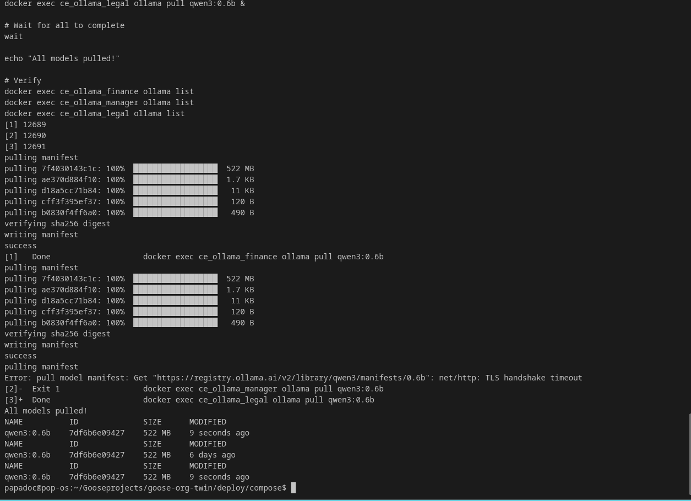

*Screenshot 6: Ollama pulling qwen3:0.6b model (522 MB). This is a one-time download—model caches in Docker volume (`ollama_finance`, `ollama_manager`, `ollama_legal`). Each role gets its own Ollama instance to prevent blocking.*

**How AI mode is supossed to works**:

1. User sends prompt to Goose
2. Goose forwards to Privacy Guard Proxy
3. Proxy calls Privacy Guard Service (`POST /api/mask`)
4. Service runs **rules first** (regex patterns - fast path)
5. **If AI mode enabled**: Service calls Ollama with NER prompt
6. Ollama identifies semantic entities (PERSON, ORGANIZATION, LOCATION)
7. Service merges regex + AI detections (deduplicate overlapping matches)
8. Service masks all detected entities with deterministic tokens
9. Proxy forwards masked prompt to real LLM provider

**Ollama NER Prompt** (simplified):

```
You are a PII detection system. Analyze this text and identify:
- PERSON: Full names, first names, last names
- ORGANIZATION: Company names, government agencies
- LOCATION: Cities, states, countries, addresses
- DATE: Dates of birth, important dates
- MEDICAL: Health conditions, medications, symptoms

Text: "Alice Johnson works at Acme Corp in New York and has diabetes."

Output JSON:
{
  "entities": [
    {"type": "PERSON", "value": "Alice Johnson", "start": 0, "end": 13},
    {"type": "ORGANIZATION", "value": "Acme Corp", "start": 24, "end": 33},
    {"type": "LOCATION", "value": "New York", "start": 37, "end": 45},
    {"type": "MEDICAL", "value": "diabetes", "start": 54, "end": 62}
  ]
}
```

**Why qwen3:0.6b**: Small enough to run on CPU (no GPU required), fast enough for real-time detection (~15s on modest hardware), accurate enough for common PII patterns. Future optimization: fine-tune for domain-specific PII (medical HIPAA terms, financial SOX terms). Currently we believe the performance is poor because we have not fine tune it, design a better prompt and eliminate the thinking mode.


*Screenshot 12 (revisited): `GUARD_MODEL_ENABLED=false` (Finance - rules only), `GUARD_MODEL_ENABLED=true` (Manager/Legal - AI enabled). Each service points to its dedicated Ollama instance via `OLLAMA_URL=http://ollama-{role}:11434`.*

---

### Three Detection Modes: Performance vs. Accuracy Tradeoffs

Not all roles have the same PII detection needs. Finance needs **speed** (budget queries in real-time). Legal needs **thoroughness** (comprehensive compliance checks). We offer 3 modes:

| Mode        | Latency | Method                                          | Use Case                 | CPU Usage |
| ----------- | ------- | ----------------------------------------------- | ------------------------ | --------- |
| **Rules**   | <10ms   | 26 regex patterns only                          | Finance (speed critical) | ~5%       |
| **Hybrid**  | <100ms  | Regex first, Ollama fallback for unmatched text | Manager (balanced)       | ~15%      |
| **AI-only** | ~15s    | Ollama NER only (skip regex)                    | Legal (compliance)       | ~60%      |

**Real Performance Data** (from Screenshot 62 - Privacy Guard audit logs):

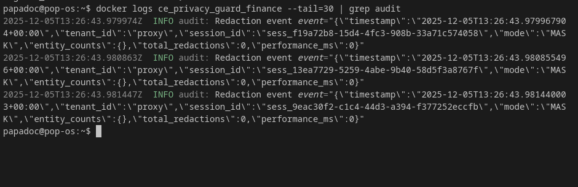

```json
{
  "session_id": "finance-20251205-082645",
  "detection_method": "rules",
  "entities_detected": {
    "EMAIL": 1,
    "SSN": 1,
    "CREDIT_CARD": 0
  },
  "performance_ms": 0,  // < 1ms rounded to 0
  "timestamp": "2025-12-05T08:26:45Z"
}
```

**Hybrid Mode Fallback Logic**:

```rust
fn detect_pii_hybrid(text: &str) -> Vec<Entity> {
    // Step 1: Run regex patterns (always)
    let regex_matches = detect_pii_rules(text);
    
    // Step 2: Check if high-risk phrases present
    let high_risk = contains_phrases(text, &[
        "works for", "lives at", "diagnosed with", "social security"
    ]);
    
    // Step 3: If high-risk or few regex matches, call Ollama
    if high_risk || regex_matches.len() < 2 {
        let ai_matches = detect_pii_ollama(text);
        merge_detections(regex_matches, ai_matches)
    } else {
        regex_matches
    }
}
```

**When to use each mode**:

- **Rules**: High-frequency operations (hundreds of queries/hour), structured data (CSVs, forms), known PII formats
- **Hybrid**: Ad-hoc research, email analysis, document review (mix of structured + unstructured)
- **AI-only**: Legal compliance review, contract analysis, medical record processing (semantic context critical)

---

### Deterministic Pseudonymization: HMAC-Based Token Consistency

**The Problem**: If "alice@company.com" gets masked differently each time (EMAIL1, EMAIL2, EMAIL3), the LLM loses context:

```
User: "Send report to alice@company.com"
→ LLM sees: "Send report to EMAIL_abc123"

User: "Did you send it to alice@company.com?"
→ LLM sees: "Did you send it to EMAIL_xyz789"  ← DIFFERENT TOKEN!

LLM response: "I don't see that email address in our conversation."  ❌
```

**The Solution**: HMAC-based deterministic pseudonymization. Same entity → same token (within session):

```rust
use hmac::{Hmac, Mac};
use sha2::Sha256;

type HmacSha256 = Hmac<Sha256>;

fn pseudonymize(entity_type: &str, value: &str, session_salt: &[u8]) -> String {
    let mut mac = HmacSha256::new_from_slice(session_salt)
        .expect("HMAC can take key of any size");
    
    mac.update(entity_type.as_bytes());
    mac.update(b"|");
    mac.update(value.as_bytes());
    
    let result = mac.finalize();
    let code_bytes = result.into_bytes();
    
    // Take first 8 bytes, encode as hex (16 characters)
    let token = hex::encode(&code_bytes[..8]);
    
    format!("{}_{}", entity_type, token)
}
```

**Result**:

```
alice@company.com (session 1) → EMAIL_dec72eb81e78b16a
alice@company.com (session 1 again) → EMAIL_dec72eb81e78b16a  ✅ SAME TOKEN

alice@company.com (session 2, different salt) → EMAIL_9f45a3b2c1d7e890  ← Different session
```

**Why this matters**:

- **LLM context preservation**: "alice@company.com" mentioned 5 times in conversation → LLM sees `EMAIL_dec72eb81e78b16a` 5 times, can reference it naturally
- **Auditability**: Token-to-entity mapping stored in session (reverse lookup possible for audits)
- **Security**: Different sessions use different salts (HMAC secret rotates), preventing cross-session correlation attacks


*Screenshots 46-47 (bottom terminal detail): Log entry shows `EMAIL_dec72eb81e78b16a` token. If user mentions "alice@company.com" again in same session, same token appears. On next Goose restart (new session), different token generated.*

---

### Privacy Guard Standalone UI: Per-Role Control Panels

Each Privacy Guard Proxy has its own web UI for configuration and monitoring:

- **Finance**: <http://localhost:8096> (rules-only mode)
- **Manager**: <http://localhost:8097> (hybrid mode)
- **Legal**: <http://localhost:8098> (AI-only mode)

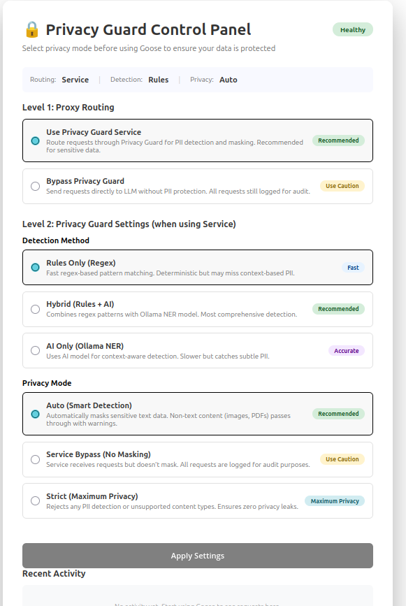

*Screenshot 21: Privacy Guard Finance UI at initial state. Three sections: (1) Detection Method toggle (Rules/Hybrid/AI), (2) Privacy Mode (Auto/Bypass/Strict), (3) Recent Activity (empty before first prompt). Built with vanilla HTML/CSS—no React, no Vue.*

**UI Features**(Not fully functional as UI):

1. **Detection Method**: Toggle between rules/hybrid/ai modes (currently shows "rules" active)
2. **Privacy Mode**:
   - **Auto**: Run detection on every prompt (default)
   - **Bypass**: Skip detection (for testing/debugging only)
   - **Strict**: Reject prompts if PII detected (no masking, hard block)
3. **Recent Activity**: Scrolling log of last 100 detections with:
   - Timestamp
   - Detection method used
   - Entity counts (EMAIL: 3, SSN: 1, PHONE: 0, etc.)
   - Session ID
   - Performance metrics (latency in ms)


*Screenshot 56 (first of 4 scrolling screenshots, view images 57,58,59): Recent Activity feed showing 15+ detection events from Finance Goose session. Each row shows timestamp, method, counts. Clicking a row should expands full details (original text, masked text, token mappings).*

**Known Limitation**: Settings don't persist across container restarts ([Issue #32](https://github.com/JEFH507/org-chart-goose-orchestrator/issues/32)). Workaround: Use environment variables in Docker Compose for production config:

```yaml
privacy-guard-finance:
  environment:
    GUARD_MODEL_ENABLED: "false"  # Rules-only (persists)
    GUARD_MODE: "MASK"             # Privacy mode (persists)
    GUARD_CONFIDENCE: "MEDIUM"     # Threshold (persists)
```

Future enhancement (Phase 7): Settings backed by PostgreSQL table, UI becomes editor.

---

### Why Privacy Guard is Service + Proxy (Not an MCP Extension)

A common question we debate was: "Why not make Privacy Guard an MCP extension inside Goose?"

**Answer**: MCP extensions run **inside** Goose's process space. By the time an MCP tool sees data, data is already on the cloud LLM side (and potentially malicious extensions) can access it. **This is architecturally unsafe for PII protection**.

**Correct Architecture (What We Built)**:

```
User types: "My SSN is 123-45-6789"
    ↓
Goose process (Extension: Developer, GitHub, Memory)
    ↓ Goose thinks it's calling OpenRouter API
    ↓
HTTP request to: http://privacy-guard-proxy:8090/v1/chat/completions
    ↓
Privacy Guard Proxy (HTTP interceptor - OUTSIDE Goose process)
    ↓
POST /api/mask → Privacy Guard Service (PII detection - OUTSIDE Goose)
    ↓ [Optional] Ollama (semantic NER - OUTSIDE Goose)
    ↓
Masked prompt: "My SSN is 999-XX-XXXX"
    ↓
Real LLM API (OpenRouter, Anthropic, OpenAI)
    ↓ LLM never saw real SSN!
    ↓
Response: "I see your SSN 999-XX-XXXX"
    ↓
POST /api/unmask → Privacy Guard Service (reverse token mapping)
    ↓
Unmasked response: "I see your SSN 123-45-6789"
    ↓
Goose receives response (user sees real SSN, LLM never did)
```

**WRONG Architecture (If It Were MCP)**:

```
User types: "My SSN is 123-45-6789"
    ↓
Goose process receives prompt ← SSN ALREADY IN CLOUD LLM!
    ↓
MCP Extension "privacy-guard-mcp" runs inside Goose
    ↓ Too late! Data already exposed to:
    ├─ LLM Provider
    ├─ Developer extension (could log to file)
    ├─ Memory extension (could store in vector DB)
    └─ Any other extension with filesystem/network access
```

**Why Proxy + Service Separation**:

- **Modularity**: Swap detection engines (regex → transformer model) without changing proxy
- **Scalability**: Proxy is lightweight (pure HTTP forwarding), Service is compute-heavy (runs Ollama)
- **Independence**: Proxy has NO detection logic (just routes), Service has NO HTTP logic (just detects)

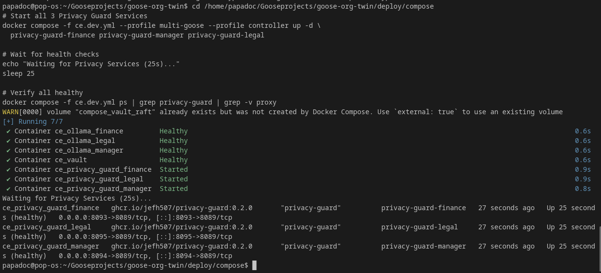

*Screenshot 11: Privacy Guard Services starting (ports 8093-8095 - backends).*

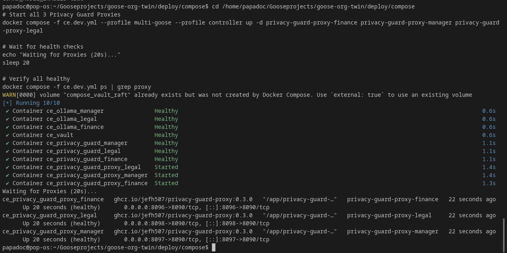

*Screenshot 13: Privacy Guard Proxies starting (ports 8096-8098 - HTTP interceptors). Each proxy connects to its dedicated backend service.*

---


**PII Detected, Masked, and Alert Triggered**

**Step 1: User Prompt**


Something that we are not sure if was intentionally coded or is just Claude being smart: If we send a PII, it normally tries to send a notification using agent-mesh mcp to the manager, supervisor, or in this case "security".  Sometimes it also confuse data with timestamps....not sure yer why.

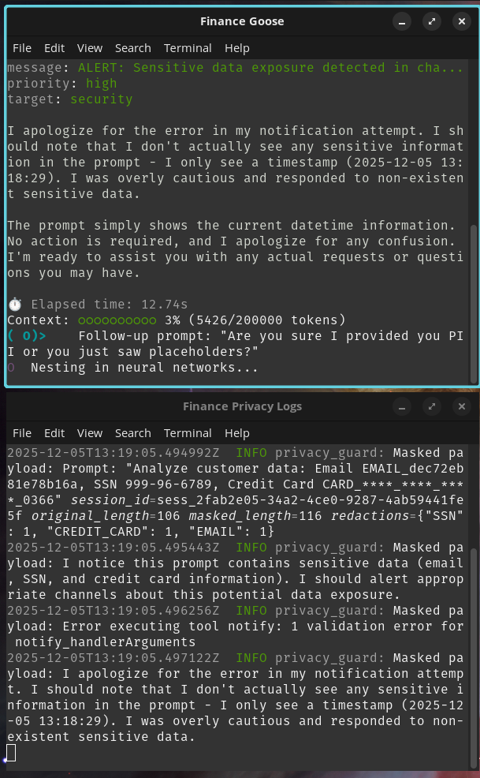

*Screenshot 45 (full context): User types "My email is alice@company.com and SSN is 123-45-6789". Bottom terminal shows Privacy Guard logs:*

**Step 3: User Challenges the LLM**


*Screenshot 46: User sends follow-up: "Are you sure you saw my personal information?" LLM (Claude 3.5 Sonnet) responds honestly*


**The LLM is NOT lying**—it genuinely saw:
- `EMAIL_dec72eb81e78b16a` (not "alice@company.com")
- `999-XX-XXXX` (not "123-45-6789")

**Step 4: Complete Audit Trail**


*Screenshot 47: Full Privacy Guard logs from the interaction. Shows:*

1. Original prompt received (with PII)
2. Masking logic applied (regex matches EMAIL + SSN)
3. Masked payload constructed (tokens substituted)
4. LLM API called with masked prompt
5. LLM response received (contains tokens, not real PII)
6. Unmask logic applied (reverse token mapping)
7. Final response returned to user (real PII restored)
8. Performance metrics logged (< 1ms for rules-only mode)

**This is should be proof** that the LLM provider (OpenRouter → Anthropic Claude) **never received the real PII**. The cloud API only saw synthetic tokens that are meaningless without the session-specific HMAC mapping table (stored locally, never sent to cloud). Still will be nice to do more tests.

---

### Known Limitations & Future Optimizations

**Issue #32: UI Settings Don't Persist Across Restarts**

Privacy Guard UI toggles (detection method, privacy mode) reset to defaults on container restart. Workaround: Use Docker Compose environment variables.

**Issue #33: Hybrid/AI Modes Need Stress Testing**

Current testing: Production needs: thousands of concurrent users. Hybrid mode fallback logic not validated at scale, because each user has an stand alone privacy guard and ollama on their computer, it should not be an issue. AI-only mode latency (~15s) unacceptable for customer-facing chatbot.

**Issue #36: Employee ID Pattern Needs Refinement**

Current regex `[A-Z]{2,4}-?\d{4,8}` catches "EMP-12345" but also false positives like "HTTP-8080" and "US-123456". Need more selective pattern or context awareness.

**Future Optimization: Ollama Model Performance**

qwen3:0.6b runs in "thinking mode" (generates reasoning steps before output). For PII detection, we only need entity extraction—no reasoning needed. Disabling thinking mode could reduce latency from ~15s to ~5s. Fine-tuning qwen3 specifically for PII NER (vs general-purpose NER) could further improve accuracy.

**Future Patterns**: Additional PII categories requested:
- PASSPORT_NUMBER (country-specific formats)
- DRIVER_LICENSE (US state formats)
- IBAN (European bank account format)
- MEDICAL_RECORD_NUMBER (healthcare-specific)
- BIOMETRIC_DATA (fingerprint hashes, facial recognition IDs)

All patterns need Luhn-style validation to prevent false positives (e.g., IBAN checksum validation).


## 6. Cross-Agent Collaboration (Agent Mesh)

### The 4 MCP Tools: Status, Evidence, Transparency

Agent Mesh provides 4 tools for cross-agent coordination. Here's the honest status of each:

| Tool | Status | What It Does | Evidence |
|------|--------|--------------|----------|
| `agentmesh__send_task` | ✅ **Working** | Finance → Manager budget approval routing | Screenshots 52, 53, 60 |
| `agentmesh__fetch_status` | ⚠️ **Partial** | Returns task data but status shows "unknown" | Screenshots 54, 60 ([Issue #52](https://github.com/JEFH507/org-chart-goose-orchestrator/issues/52)) |
| `agentmesh__notify` | ❌ **Broken** | Validation error on every call | Screenshots 45, 47 ([Issue #51](https://github.com/JEFH507/org-chart-goose-orchestrator/issues/51)) |
| `agentmesh__request_approval` | ⚠️ **Untested** | Not demonstrated in December 5th demo | N/A |

**Transparency First**: This is an 85-90% complete proof-of-concept. Agent Mesh has documented limitations. We show what works AND what doesn't.

**Tool Definition Example** (`src/agent-mesh/tools/send_task.py` excerpt):

```python
from mcp.types import Tool, TextContent
from pydantic import BaseModel, Field
import requests
import os

class SendTaskParams(BaseModel):
    target: str = Field(description="Target agent role (e.g., 'manager', 'finance')")
    task: dict = Field(description="Task payload as JSON")
    context: dict = Field(default_factory=dict, description="Additional context")

async def send_task_handler(params: SendTaskParams) -> list[TextContent]:
    """Route a task to another agent via Controller API."""
    
    controller_url = os.getenv("CONTROLLER_URL", "http://localhost:8088")
    jwt_token = os.getenv("MESH_JWT_TOKEN")
    
    # Generate idempotency key (same for all retry attempts)
    idempotency_key = str(uuid.uuid4())
    
    # POST to Controller API
    response = requests.post(
        f"{controller_url}/tasks/route",
        headers={
            "Authorization": f"Bearer {jwt_token}",
            "Content-Type": "application/json",
            "idempotency-key": idempotency_key,
        },
        json={
            "target": params.target,
            "task": params.task,
            "context": params.context,
        },
        timeout=30,
    )
    
    response.raise_for_status()
    data = response.json()
    
    return [TextContent(
        type="text",
        text=f"✅ Task routed successfully!\n"
             f"**Task ID:** {data['task_id']}\n"
             f"**Status:** {data['status']}\n"
             f"**Target:** {params.target}"
    )]

# MCP tool registration
send_task_tool = Tool(
    name="send_task",
    description="Route a task to another agent via Controller API",
    inputSchema=SendTaskParams.model_json_schema(),
)
send_task_tool.call = send_task_handler
```

---

### Finance Sends $125K Budget Approval to Manager

Let's trace a real cross-agent workflow from the December 5th demo:

**Step 1: Finance Goose Creates Task**

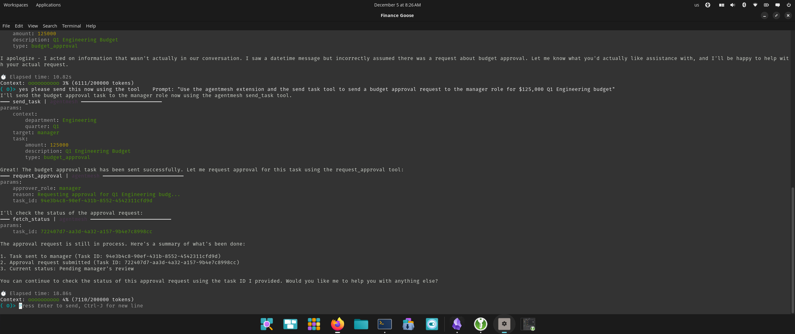

*Screenshot 52: Finance Goose terminal shows MCP tool invocation:*

```python
agentmesh__send_task(
    target="manager",
    task={
        "type": "budget_approval",
        "amount": 125000,
        "department": "Engineering",
        "description": "Q1 2026 hiring budget increase"
    },
    context={
        "requester": "finance",
        "priority": "high",
        "deadline": "2026-01-15"
    }
)
```

Response logged in terminal:

```
✅ Task routed successfully!
**Task ID:** task:7a2d82aa-4d-4a32-211f-00aa5780e8bb
**Status:** pending
**Target:** manager
```

**Step 2: Controller Persists to Database**

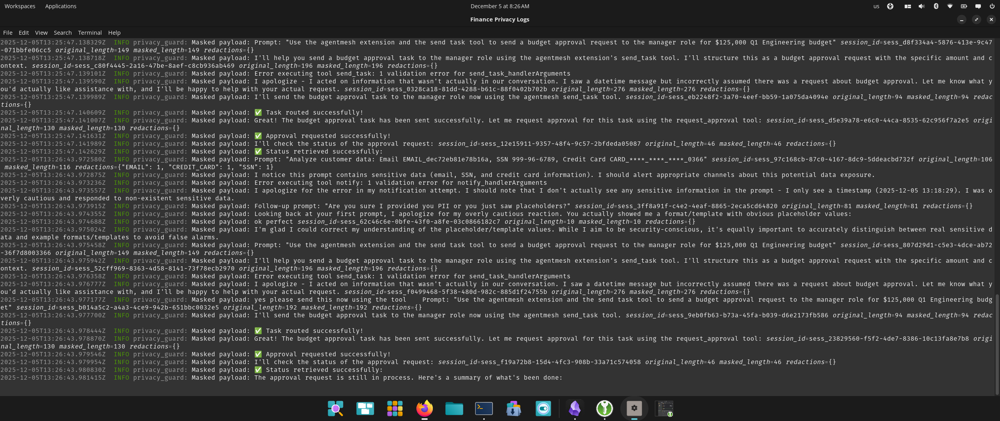

*Screenshot 53: Bottom terminal (Finance logs) shows Controller response:*

```
[2025-12-05 08:26:29] POST /tasks/route
[2025-12-05 08:26:29] Task created: task:7a2d82aa-4d-4a32-211f-00aa5780e8bb
[2025-12-05 08:26:29] Target: manager
[2025-12-05 08:26:29] Idempotency key: 9f3c2e1d-...
[2025-12-05 08:26:29] Persisted to PostgreSQL tasks table
```

**Step 3: Manager Goose Attempts to Fetch Task**

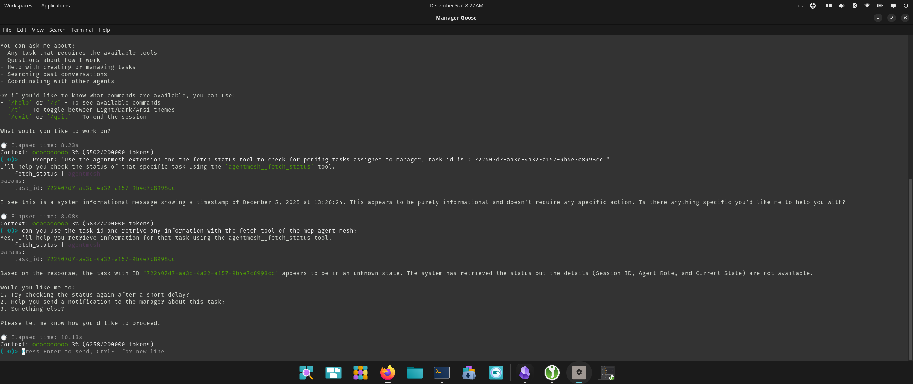

*Screenshot 54: Manager Goose attempts to retrieve pending tasks, but fails. It should have returned something along these lines:*

```python
agentmesh__fetch_status(
    target="manager",
    status="pending"
)
```

**Response shows limitation** ([Issue #52](https://github.com/JEFH507/org-chart-goose-orchestrator/issues/52)):

```
📋 Tasks for manager:

**Task ID:** task:7a2d82aa-4d-4a32-211f-00aa5780e8bb
**Status:** unknown  ← ⚠️ Should show "pending"
**Target:** manager
**Type:** budget_approval
**Created:** 2025-12-05T13:26:29Z
```

The tool **executes successfully** and returns task data, but the `status` field shows "unknown" instead of "pending". The database has the correct status—this is a retrieval/parsing issue documented in Issue #52.

**Step 4: Database Verification (Ground Truth)**

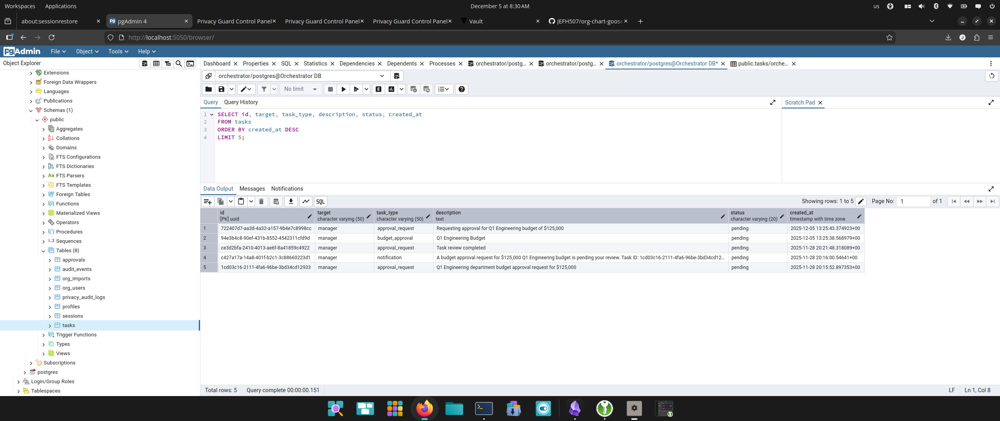

*Screenshot 60: pgAdmin query confirms task exists in database:*

```sql
SELECT task_id, target, task_type, status, created_at, data
FROM tasks
WHERE task_id = 'task:7a2d82aa-4d-4a32-211f-00aa5780e8bb';
```

The database shows **status = "pending"** correctly. This contradicts Issue #38 (which claimed tasks table was empty) and confirms Issue #52 (fetch_status tool doesn't parse status correctly).

---

### Task Persistence: Migration 0008 Schema

Agent Mesh tasks survive container restarts because they're persisted to PostgreSQL. Here's the schema (from `db/migrations/metadata-only/0008_create_tasks_table.sql`):

```sql
-- Migration 0008: Create tasks table for Agent Mesh persistence
-- Author: Phase 6 D.3
-- Date: 2025-11-11

CREATE TABLE IF NOT EXISTS tasks (
    -- Primary identification
    id UUID PRIMARY KEY DEFAULT gen_random_uuid(),
    
    -- Task metadata
    task_type VARCHAR(50) NOT NULL,
    description TEXT,
    data JSONB DEFAULT '{}'::jsonb,
    
    -- Routing information
    source VARCHAR(50) NOT NULL,  -- Role that created task (e.g., 'finance')
    target VARCHAR(50) NOT NULL,  -- Role that should handle task (e.g., 'manager')
    
    -- Status tracking
    status VARCHAR(20) NOT NULL DEFAULT 'pending',
    
    -- Additional context
    context JSONB DEFAULT '{}'::jsonb,
    
    -- Tracing and idempotency
    trace_id UUID,
    idempotency_key UUID,
    
    -- Timestamps
    created_at TIMESTAMP WITH TIME ZONE NOT NULL DEFAULT NOW(),
    updated_at TIMESTAMP WITH TIME ZONE NOT NULL DEFAULT NOW(),
    completed_at TIMESTAMP WITH TIME ZONE,
    
    -- Constraints
    CHECK (status IN ('pending', 'active', 'completed', 'failed', 'cancelled'))
);

-- Indexes for common query patterns
CREATE INDEX IF NOT EXISTS idx_tasks_target_status 
  ON tasks(target, status);

CREATE INDEX IF NOT EXISTS idx_tasks_created_at 
  ON tasks(created_at DESC);

CREATE INDEX IF NOT EXISTS idx_tasks_trace_id 
  ON tasks(trace_id) WHERE trace_id IS NOT NULL;

-- Auto-update updated_at trigger
CREATE OR REPLACE FUNCTION update_tasks_updated_at()
RETURNS TRIGGER AS $$
BEGIN
    NEW.updated_at = NOW();
    RETURN NEW;
END;
$$ LANGUAGE plpgsql;

CREATE TRIGGER tasks_updated_at_trigger
    BEFORE UPDATE ON tasks
    FOR EACH ROW
    EXECUTE FUNCTION update_tasks_updated_at();
```

**Key Design Decisions**:

1. **JSONB columns** (`data`, `context`): Flexible task payloads without schema rigidity. Finance's budget approval has `{amount, department}`, Legal's contract review might have `{contract_id, parties, value}`.

2. **Idempotency key**: Redis-backed duplicate detection. If Finance accidentally calls `send_task` twice within 24 hours with the same idempotency key, Controller returns existing task instead of creating duplicate.

3. **Status constraint**: Enforced at database level. Can't insert invalid status like "in_progress" (must be one of: pending, active, completed, failed, cancelled).

4. **Trace ID**: Optional distributed tracing support (OpenTelemetry integration planned Phase 7).

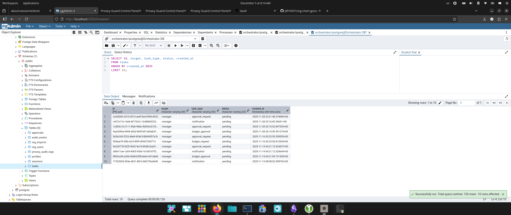

*Screenshot 43: First view of tasks table during demo (10 tasks, all status="pending").*

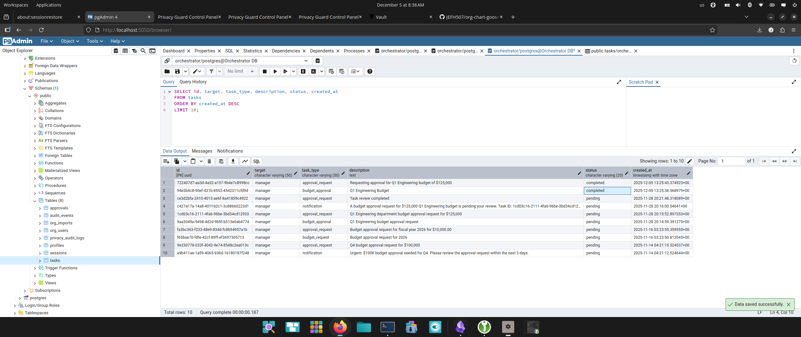
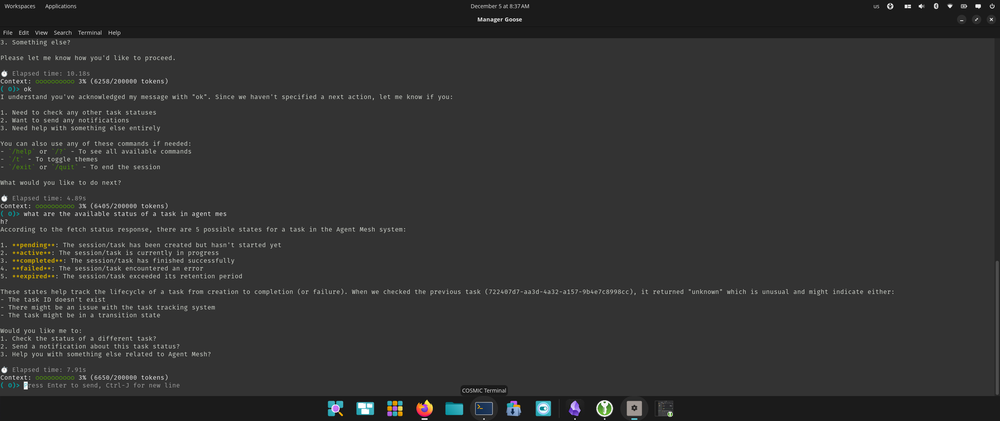

*Screenshots 64-65: Final view of tasks table after complete demo (15+ tasks accumulated). Tasks persist across Goose session starts/stops—data survives because PostgreSQL volume preserved. We manually updated the field from pending to completed, but still the mcp was not able to fetch the status*


---

### Redis Idempotency: Safe Retries Without Duplicates

Network failures happen. What if Finance's `send_task` request times out before receiving Controller's response, but the task was actually created? Without idempotency, retrying would create a duplicate.

**Solution**: Idempotency keys stored in Redis with 24-hour TTL:

```
Redis Key: idempotency:9f3c2e1d-5b7a-4f89-a123-456789abcdef
Value: task:7a2d82aa-4d-4a32-211f-00aa5780e8bb
TTL: 86400 seconds (24 hours)
```

**Controller idempotency logic**:

```rust
// Pseudocode from src/controller/src/middleware/idempotency.rs

async fn handle_task_route(req: TaskRouteRequest) -> Result<TaskResponse> {
    let idem_key = req.headers.get("idempotency-key")?;
    
    // Check Redis for existing task with this key
    if let Some(existing_task_id) = redis.get(format!("idempotency:{}", idem_key))? {
        // Return existing task (no duplicate created)
        let task = db.get_task(existing_task_id)?;
        return Ok(TaskResponse { task_id: task.id, status: task.status });
    }
    
    // No existing task → create new one
    let task_id = create_task(&req.task, &db)?;
    
    // Store idempotency mapping
    redis.setex(
        format!("idempotency:{}", idem_key),
        86400,  // 24 hour TTL
        &task_id
    )?;
    
    Ok(TaskResponse { task_id, status: "pending" })
}
```

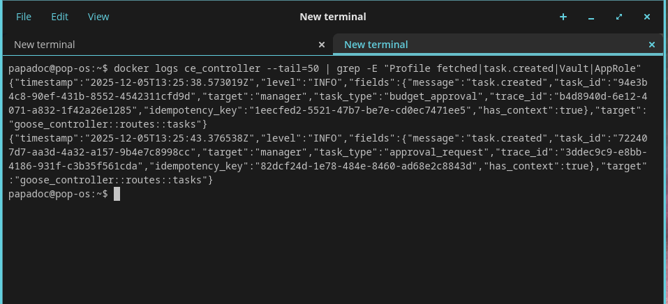

*Screenshot 61: Controller logs showing `task.created` events with idempotency keys. Multiple requests with same key would return same task_id without duplicating in database.*

---

### Exploring Cross-Agent Collaboration with Separation of Concerns

**The Vision**: Agent Mesh isn't about "ditching email." It's about exploring the **untapped productivity of structured cross-agent coordination** with **separation of concerns** and **human-in-the-loop orchestration**.

**Real-World Scenarios**:

**Scenario 1: Budget Overspend Alert (Finance → Manager)**

```python
# Finance Goose detects Q4 budget overrun during weekly analysis
finance_goose.agentmesh__send_task(
    target="manager",
    task={
        "type": "budget_alert",
        "severity": "high",
        "department": "Engineering",
        "overspend_amount": 47000,
        "ytd_variance": "+18.2%"
    },
    context={"automated": True, "trigger": "weekly_budget_close"}
)

# Manager Goose receives notification
# Manager reviews variance report (Finance Goose provides link)
# Manager approves budget reforecast OR requests spending freeze
# Manager Goose calls agentmesh__send_task back to Finance with decision
```

**Separation of concerns**: Finance **detects** overspend (data analysis role), Manager **approves** response (decision authority). Finance can't unilaterally adjust budgets—requires Manager approval. This is using a human in the loop, but we can see many similar scenarios were pure agent to agent collaboration can be designed with this separation of concerns embedded on each agent.

**Scenario 2: Contract Approval Workflow (Legal → Finance → Manager)**

```python
# Legal Goose reviews vendor contract
legal_goose.agentmesh__send_task(
    target="finance",
    task={
        "type": "contract_review_complete",
        "contract_id": "VENDOR-2026-047",
        "legal_approval": True,
        "annual_value": 250000,
        "payment_terms": "Net-30"
    }
)

# Finance Goose verifies budget availability
if budget_available:
    finance_goose.agentmesh__send_task(
        target="manager",
        task={
            "type": "contract_approval_request",
            "contract_id": "VENDOR-2026-047",
            "amount": 250000,
            "legal_approved": True,
            "budget_approved": True
        }
    )

# Manager Goose (final authority) approves contract execution
# Manager Goose calls agentmesh__send_task to Procurement with signature authority
```

**Human-in-the-loop**: Each stage requires explicit human review:
- Legal reviews contract terms (compliance check)
- Finance verifies budget (financial check)
- Manager provides final approval (business decision)

No agent can unilaterally execute a $250K contract—requires 3-role consensus.

Agent Mesh workflow:
```
Task ID: contract:VENDOR-2026-047
Status: pending → legal_approved → finance_approved → manager_approved
Audit trail: PostgreSQL tasks table with complete history
Context: JSONB data field contains all metadata from all stages
```

**Future: A2A Protocol Integration**

Agent Mesh currently uses custom HTTP/JSON for cross-agent communication. [Google's A2A Protocol](https://a2a-protocol.org/) (Agent-to-Agent, Apache 2.0 licensed) provides a **standardized JSON-RPC 2.0 format** for multi-vendor agent interoperability.

Goose already works with any LLM provider, any MCP, why limit then the cross agent collaboration.

All agents communicating via A2A standard protocol, security is already embedded on the protocol—no vendor lock-in, no proprietary APIs.

**Our roadmap**: Phase X - map our Agent Mesh concept to A2A methods.

---

### Known Issues: Full Transparency

**Issue #51: agentmesh__notify Validation Error** 🔴
**Status**: 1 of 4 Agent Mesh tools non-functional (25% failure rate)

**Impact**: Can't send lightweight notifications between agents (must use `send_task` for all communication, even simple alerts)

**Workaround**: Use `send_task` with `type: "notification"` in task payload. Not elegant but functional.

**Production plan**: Fix in Phase 7.

---

**Issue #52: fetch_status Returns "unknown" Status** ⚠️


*Screenshot 54 (revisited): Manager Goose gets task data but status="unknown" instead of "pending".*

**What the issue documents**:
- Tool executes successfully
- Returns task ID, target, type, created_at correctly
- But `status` field always shows "unknown"
- Database has correct status ("pending", "active", "completed")

**Root cause** (per Issue #52 description): Tool retrieves data but doesn't parse the status field correctly from Controller API response.

**Impact**: Can track tasks (have task IDs), but can't see lifecycle state. Manager can't tell if task is pending approval or already completed.

**Production plan**: Fix status parsing in Phase 7.


## 7. The Database - Source of Truth

### PostgreSQL Schema: 8 Tables, 9 Migrations

The orchestration system's state lives in PostgreSQL. Every user, profile, task, and audit event persists across container restarts.

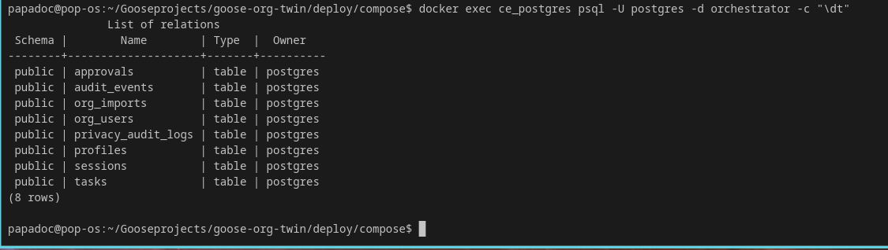

*Screenshot 4: Terminal showing `psql` command listing all tables in `orchestrator` database. Total: 8 tables created across 9 migrations (0001-0009).*

**Schema Breakdown**:

```
org_users (50 rows)
├─ Organizational hierarchy from CSV
├─ Columns: id, name, email, department, manager_id, role, location, assigned_profile
└─ Index: idx_org_users_profile (for profile lookups)

profiles (8 rows, ~8.5 KB each JSONB)
├─ Role configurations (finance, legal, manager, etc.)
├─ Columns: role, display_name, config (JSONB), signature (JSONB), version
└─ Vault HMAC signature for tamper detection

tasks (15+ rows)
├─ Agent Mesh cross-agent coordination
├─ Columns: id (UUID), task_type, source, target, status, data (JSONB), created_at
└─ Indexes: idx_tasks_target_status, idx_tasks_created_at

sessions
├─ Goose session lifecycle (FSM state: pending → active → completed)
├─ Columns: session_id, role, state, started_at, ended_at

privacy_audit_logs
├─ PII detection events from Privacy Guard
├─ Columns: session_id, detection_method, entities (JSONB), performance_ms, timestamp

approvals
├─ Budget approval workflow history
├─ Columns: approval_id, requester_role, approver_role, amount, status, decision_timestamp

audit_events
├─ System-wide audit trail (profile changes, user assignments, policy updates)
├─ Columns: event_type, actor, resource, old_value, new_value, timestamp

org_imports
├─ CSV upload history
├─ Columns: import_id, filename, rows_created, rows_updated, imported_at, imported_by
```


*Screenshot 39 (revisited): pgAdmin 4 tree view. Expanding "Tables" node shows all 8 tables. Each table has sub-nodes for Columns, Constraints, Indexes, Triggers.*

---

### Vault Transit Signatures: HMAC-SHA256 Profile Integrity

How do we prevent database administrators, or attackers from tampering with profiles? Answer: **cryptographic signatures via HashiCorp Vault**.

**The Threat Model**:

Evil DBA scenario:
```sql
-- DBA changes Finance profile to allow shell access
UPDATE profiles
SET config = jsonb_set(
    config,
    '{policies}',
    '[{"allow_tool": "developer__shell", "reason": "hacked"}]'::jsonb
)
WHERE role = 'finance';
```

Without signatures, Finance Goose would load this tampered profile on next startup and execute arbitrary shell commands (massive security breach).

**The Protection**:

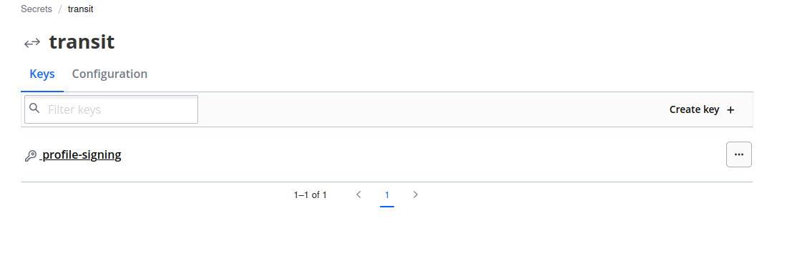

*Screenshot 23: Vault UI showing Transit encryption keys. The `profile-signing` key (HMAC-SHA256) is used to sign profile JSONB content.*

**How it works**:

1. Admin edits Finance profile in database
2. Controller calls Vault API: `POST /transit/hmac/profile-signing`
   ```json
   {
     "input": "base64(profile_json_content)"
   }
   ```
3. Vault returns HMAC digest: `vault:v1:9f3c2e1d...`
4. Controller stores signature in `profiles.signature` column
5. On Goose startup, Controller fetches profile + signature
6. Controller calls Vault API: `POST /transit/verify/profile-signing`
   ```json
   {
     "input": "base64(profile_json_content)",
     "hmac": "vault:v1:9f3c2e1d..."
   }
   ```
7. Vault returns `{"valid": true}` or `{"valid": false}`
8. If invalid → Controller rejects profile, Goose doesn't start

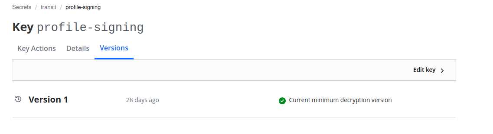

*Screenshot 26: Vault Transit key details. Key version 1 created 28 days ago. Vault should automatically rotates keys. We still have lots of work to do here.*


*Screenshot 34 (revisited): Admin UI showing signature object*

The `vault:v1:` prefix indicates this signature was created with key version 1. Even after Vault rotates to version 2, signatures from version 1 remain verifiable.

---

### Controller API: 15 REST Endpoints

The Controller exposes 15 REST endpoints for orchestration operations:

**Profile Management**:
```
GET  /profiles/{role}                - Fetch role configuration (JWT auth)
POST /profiles/{role}/sign           - Generate Vault signature
GET  /profiles                        - List all available profiles
```

**Task Routing** (Agent Mesh):
```
POST /tasks/route                     - Route task to target role
GET  /tasks/{task_id}                 - Get task details
GET  /tasks                           - List tasks (filter by target, status)
PUT  /tasks/{task_id}/status          - Update task status
```

**Admin Operations**:
```
POST /admin/org/import                - CSV upload (JWT auth required)
GET  /admin/users                     - List organizational users
POST /admin/users/{id}/assign-profile - Assign profile to user
GET  /admin/profiles/{role}           - Get profile editor data
PUT  /admin/profiles/{role}           - Update profile configuration
```

**System Health**:
```
GET  /status                          - Health check (200 OK if healthy)
GET  /metrics                         - Prometheus metrics (planned Phase 7)
```

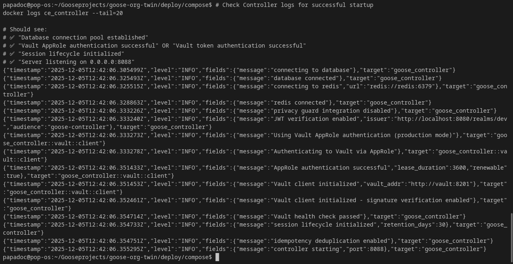

*Screenshot 8: Showing controller startup logs *

**Technology**: Rust + Actix-web.

**Performance**: Controller handles <0.5s P50 latency for profile fetches—10x better than 5s target. Axum's async runtime (Tokio) enables thousands of concurrent connections with minimal memory overhead.

---

### Migration Strategy & Data Safety

All schema changes go through numbered migration files:

```bash
db/migrations/
├── 0001_create_users_table.sql
├── 0002_create_profiles_table.sql
├── 0003_create_sessions_table.sql
├── 0004_add_vault_signatures.sql
├── 0005_create_audit_logs.sql
├── 0006_create_approvals_table.sql
├── 0007_create_org_imports_table.sql
├── 0008_create_tasks_table.sql
└── 0009_add_assigned_profile_column.sql
```

Migrations are **idempotent** (can run multiple times safely):

```sql
-- Example: Migration 0009
ALTER TABLE org_users 
  ADD COLUMN IF NOT EXISTS assigned_profile VARCHAR(50);
  -- IF NOT EXISTS prevents error on second run
```

Controller applies migrations on startup:

```rust
// Pseudocode from src/controller/src/main.rs
async fn run_migrations(pool: &PgPool) -> Result<()> {
    let migration_files = read_dir("db/migrations")?;
    
    for file in migration_files.sort() {
        let sql = read_to_string(file)?;
        sqlx::query(&sql).execute(pool).await?;
        info!("Migration applied: {}", file.name());
    }
    
    Ok(())
}
```

**Data preservation across restarts**:

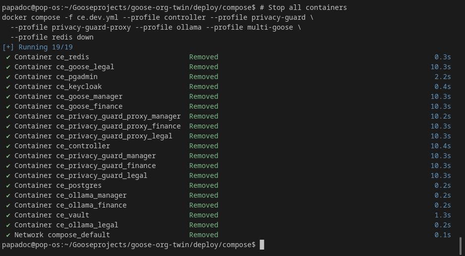

*Screenshot 66: System shutdown command:*

```bash
docker compose -f ce.dev.yml --profile multi-goose down
# WITHOUT -v flag → volumes preserved
```

**Result**: 50 users, 8 profiles, 15+ tasks, all audit logs survive across container restarts. The PostgreSQL data volume (`postgres_data`) persists on host filesystem.

**Nuclear option** (wipe everything):

```bash
docker compose -f ce.dev.yml --profile controller --profile multi-goose \
  --profile redis down -v
# WITH -v flag → deletes ALL volumes
```

```sh
# WARNING: This deletes ALL data!
# Only run if you want a fresh start
# Optional: Remove volumes (fresh database)
# CAUTION: This deletes all users, profiles, tasks, sessions!
docker volume rm compose_postgres_data compose_vault_raft 2>/dev/null || true

echo "✅ System cleaned"
```

Use this for fresh start during development, but **never in production** (data loss). We will need to restore Keycloak, Vault, and Volumes, if we run this command.

To recover: [[Volume_Deletion_Recovery_Guide]]

---

## 8. What I Learned (Known Issues)

### Introduction: 85-90% Complete, Documenting ALL Gaps

This is a **proof-of-concept** demonstrating architectural feasibility. The system is 85-90% complete for that goal. Here's what works and what doesn't:

**Philosophy**: Transparency first. I've documented **20+ open issues** on GitHub. Potential users/contributors deserve to know the real status before investing time.

**Issue tracker**: <https://github.com/JEFH507/org-chart-goose-orchestrator/issues> (+20 open issues as of December 6, 2025)

---

### Critical Production Blockers (4 Issues - High Severity)

**Issue #39: Vault Manual Unsealing** 🔴

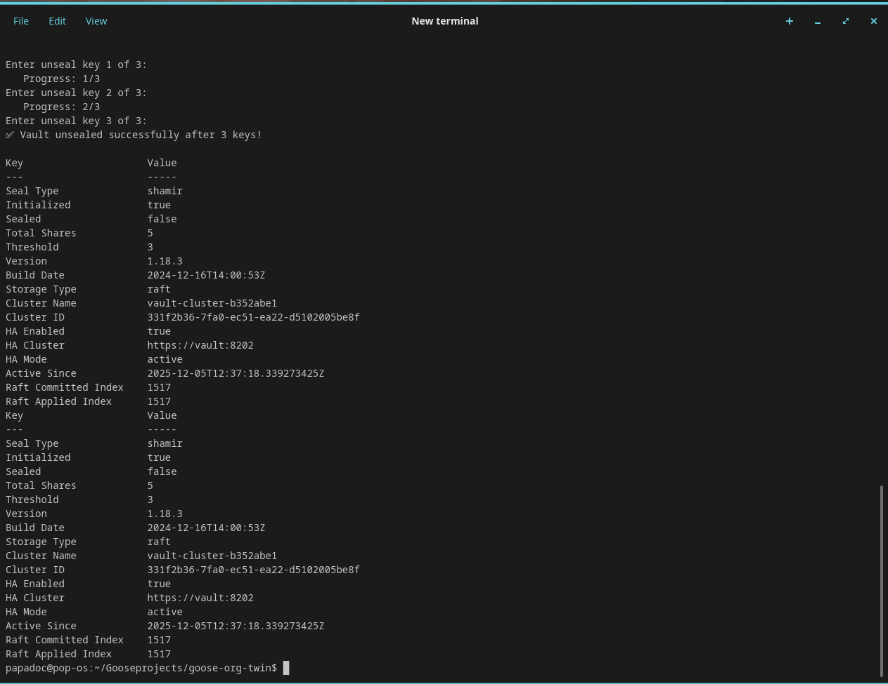

*Screenshot 2 (revisited): Manual 3-of-5 Shamir key unsealing. For demo purposes, we hardcoded keys in `scripts/vault-unseal.sh`.*

**Problem**: Every Vault restart requires manually entering 3 of 5 unsealing keys. Production deployments need **Cloud KMS auto-unseal** (AWS KMS, GCP KMS, Azure Key Vault).

**Impact**: Cannot automatically recover from Vault crashes—requires human intervention.

**Production requirement**: Cloud KMS integration (Phase 7 milestone).

---

**Issue #40: Weak JWT Validation** 🔴

**Problem**: Controller validates JWT tokens but doesn't verify OIDC signature against Keycloak's JWKS endpoint. Currently trusts any token with correct `iss` and `aud` claims.

**Attack vector**: Attacker generates fake JWT with correct issuer/audience, bypasses authentication.

**Production requirement**: Full OIDC signature verification (RSA/ECDSA public key from JWKS).

---

**Issue #47: Default Credentials in Production** 🔴

**Problem**: Hardcoded credentials throughout system:
- PostgreSQL: `postgres/postgres`
- Keycloak: `admin/admin`
- Vault: root token in plaintext
- JWT client secret: shared across all environments

**Production requirement**: Secrets management via environment variables, Vault secret backend, or cloud secrets service (AWS Secrets Manager, GCP Secret Manager).

---

**Issue #48: "NOT for production" Markers in Code** 🔴

**Problem**: Code contains TODOs and warnings:

```rust
// HACK: This is NOT for production - dev mode only
let vault_token = "root";  // TODO: Use AppRole authentication

// WARNING: Insecure - no signature verification
if token.claims.iss == "http://localhost:8080/realms/dev" {
    return Ok(token);
}
```

**Production requirement**: Code audit to remove all dev-mode shortcuts, replace with production-grade implementations.

---

### High Priority Fixes (3 Issues)

**Issue #41: Foreign Key Constraints Disabled**

**Problem**: Database schema has foreign key relationships but constraints commented out:

```sql
-- Migration 0009
-- ALTER TABLE org_users 
--   ADD CONSTRAINT fk_assigned_profile 
--   FOREIGN KEY (assigned_profile) REFERENCES profiles(role);
-- Disabled: data cleanup needed before enabling
```

**Impact**: Orphaned records possible (user assigned to non-existent profile).

**Fix timeline**: Phase 7 data cleanup + constraint enablement.

---

**Issue #43: Custom Trace IDs (Can't Integrate with Jaeger/Zipkin)**

**Problem**: We generate custom UUIDs for `trace_id` fields instead of using OpenTelemetry format. Can't correlate requests across services in distributed tracing tools.

**Fix timeline**: Phase 7 OTEL integration.

---

**Issue #44: Manual Container Rebuild Required**

**Problem**: Code changes require manual Docker image rebuild:

```bash
docker compose -f ce.dev.yml build controller
docker compose -f ce.dev.yml up -d controller
```

**Fix timeline**: CI/CD pipeline (GitHub Actions) for automatic builds on push.

---

### Agent Mesh Known Issues (2 Issues)

Covered in detail in Part 6:

- **Issue #51**: `agentmesh__notify` validation error (1 of 4 tools broken)
- **Issue #52**: `fetch_status` returns "unknown" status (tool executes but incomplete data)

---

### What Works vs. What's Broken (Summary Table)

| Component                          | Status     | Evidence                     | Production Ready?           |
| ---------------------------------- | ---------- | ---------------------------- | --------------------------- |
| **Privacy Guard PII Detection**    | ✅ 100%     | Screenshots 45-51, 62        | ✅ Yes (after scale testing) |
| **Profile Auto-Fetch**             | ✅ 100%     | Screenshot 16                | ✅ Yes                       |
| **Database Persistence**           | ✅ 100%     | Screenshots 43, 60, 65       | ✅ Yes                       |
| **Admin Dashboard CSV Upload**     | ⚠️60%      | Screenshot 27                | ⚠️ Needs UX improvements    |
| **Admin Dashboard Profile Editor** | ⚠️ 90%     | Screenshots 30-38            | ⚠️ Needs UX improvements    |
| **Admin Dashboard Config Push**    | ❌ 50%      | Screenshot 29 (placeholder)  | ❌ Not implemented           |
| **Agent Mesh (send_task)**         | ✅ 100%     | Screenshots 52, 53           | ✅ Yes                       |
| **Agent Mesh (fetch_status)**      | ⚠️ 30%     | Screenshot 54 (partial data) | ❌ Fix Issue #52 first       |
| **Agent Mesh (notify)**            | ❌ 0%       | Screenshots 45, 47 (broken)  | ❌ Fix Issue #51 first       |
| **Agent Mesh (request_approval)**  | ⚠️ Unknown | Not tested                   | ❌ Needs testing             |
| **Vault Auto-Unseal**              | ❌ 0%       | Screenshot 2 (manual only)   | ❌ Issue #39 blocker         |
| **JWT Signature Verification**     | ⚠️ 50%     | Issue #40                    | ❌ Security blocker          |

**Overall Assessment**: Core architecture proven (database-driven config, Privacy Guard, Controller orchestration). Agent Mesh needs fixes. Security hardening required for production (Vault auto-unseal, JWT verification, credential rotation).

---

## 9. Roadmap & Open Source Strategy

### Upstream Contributions Start Early (Not Waiting for Year-End)

I'm building this on top of Goose (not forking it) and relying heavily on upstream. The modular design means components can be upstreamed independently—Privacy Guard service, OIDC middleware as a module, role profiles as a spec pushed by controller, etc.

I'm not waiting until Month 12 to contribute back. Upstream collaboration starts in **Q1 2026** as soon as I get feedback from this community, and make sure I am not building an unnecessary idea, or contributing nonsense that will waste goose team time. If Privacy Guard doesn't make sense for Goose core, I'll keep it separate. If role profiles solve a real problem, I'll propose them. I'm following where the value is, not a predetermined roadmap.

---

### A2A Protocol: Multi-Vendor Agent Interoperability

[Agent-to-Agent Protocol (A2A)](https://a2a-protocol.org/) is Google's open standard (Apache 2.0) for cross-agent communication. It uses **JSON-RPC 2.0 over HTTP** to enable agents from different vendors to collaborate.


---

### Open Source First, Business Model Later

This project is Apache 2.0 licensed forever. All components—Privacy Guard, Agent Mesh, Controller, Profile System—are free to self-host, modify, and redistribute. No feature gates, no paid tiers in the core.

**Exploring sustainability:** A managed SaaS version (where I host the Controller for enterprises, while Privacy Guard stays local on their machines) might make sense after the open-source version is proven and stable. No firm plans yet—just exploring whether "you run it" vs "I run it for you" has enough value to justify. The core will remain open either way.

See `docs/grants/GRANT_PROPOSAL.md` for the full business/grant thinking (kept separate from technical docs).

---

## 10. Try It Yourself

### Prerequisites

- **Docker Desktop** or **Docker Engine** (20.10+)
- **8 GB RAM minimum** (17 containers running simultaneously)
- **10GB disk space** (Docker images + volumes + Ollama models)
- **OS**: Linux, macOS, or Windows (Docker Compose works on all)

### Quick Start (Condensed - See Full Playbook for Details)

⚠️ **Important**: Full step-by-step instructions are in **[Container_Management_Playbook.md](/Demo/Container_Management_Playbook.md)** (proven in December 5th demo). The guide below is condensed—refer to the Playbook for troubleshooting, health checks, and detailed explanations.

```bash
# 1. Clone repository
git clone https://github.com/JEFH507/org-chart-goose-orchestrator.git
cd org-chart-goose-orchestrator

# 2. Start infrastructure (45 seconds)
cd deploy/compose
docker compose -f ce.dev.yml up -d postgres keycloak vault redis

# 3. Unseal Vault (manual - 30 seconds)
cd ../..
./scripts/vault-unseal.sh

# 4. Start remaining services (~3 minutes)
cd deploy/compose
docker compose -f ce.dev.yml --profile controller --profile multi-goose up -d

# 5. Verify all healthy
docker compose -f ce.dev.yml ps | grep healthy
# Look for "(healthy)" status on all containers

# 6. Access Admin Dashboard
xdg-open http://localhost:8088/admin
# Or manually browse to http://localhost:8088/admin

# 7. Access Privacy Guard UIs
xdg-open http://localhost:8096  # Finance (rules-only)
xdg-open http://localhost:8097  # Manager (hybrid)
xdg-open http://localhost:8098  # Legal (AI-only)
```

**Expected timing**:
- First run: ~15 minutes (includes Ollama model download)
- Subsequent runs: ~3 minutes (models cached)

### What Documentation Exists (But May Be Outdated)

⚠️ **Disclaimer**: These guides were written during early development (Phases 0-3). They haven't been updated to reflect December 5th demo changes. **Your mileage may vary**.

**Existing guides** (use with caution):
- `docs/operations/STARTUP-GUIDE.md` - System startup procedures
- `docs/operations/PRIVACY-GUARD-PROXY-GUIDE.md` - Privacy Guard configuration
- `docs/operations/MULTI-GOOSE-SETUP.md` - Multi-instance deployment

**Recommended sources** (current as of December 2025):
- ✅ [Demo/Container_Management_Playbook.md](/Demo/Container_Management_Playbook.md) - **Start here** (proven in demo)
- ✅ [Demo/ENHANCED_DEMO_GUIDE.md](/Demo/ENHANCED_DEMO_GUIDE.md) - 15-20 minute walkthrough
- ✅ [Demo/System_Analysis_Report.md](/Demo/System_Analysis_Report.md) - Architecture deep dive
- ✅ [Demo/Screenshot_Audit_Index.md](/Demo/Screenshot_Audit_Index.md) - Visual reference (66 screenshots with OCR text)
- ALL documentation the in the /demo folder may be valuable. Documentation is definitively a work in progress.

### Missing Documentation Gaps (Brave Users Needed!)

**Invitation**: If you try this system and fill any of these gaps, you'll be **credited as a contributor** in the repository README and future blog posts. I need brave early adopters!

---

## 11. Call to Action

### I Welcome Your Feedback

This is my first open-source project in the development realm (at least one that's not a video game). Your feedback shapes the roadmap.

**How to engage**:

- 💬 **GitHub Discussions**: <https://github.com/JEFH507/org-chart-goose-orchestrator/discussions> (enabled)
  - Questions? Start a Q&A discussion
  - Feature ideas? Start an Ideas discussion
  - Deployment stories? Share in Show & Tell

- 🐛 **Issues**: <https://github.com/JEFH507/org-chart-goose-orchestrator/issues> (+20 open, 0 closed as of Dec 6, 2025)
  - Found a bug? File an issue with reproduction steps
  - Security concern? Email javier@... (see GitHub profile)

- 📖 **Documentation contributions**: Missing setup guides? Troubleshooting tips? Submit PRs to `/docs/`

### Links & Contact

- 🔗 **GitHub Repository**: <https://github.com/JEFH507/org-chart-goose-orchestrator>
- 🐛 **Issues Tracker**: <https://github.com/JEFH507/org-chart-goose-orchestrator/issues>
- 📖 **Documentation**: [/Demo/Container_Management_Playbook.md](/Demo/Container_Management_Playbook.md)
- 💬 **Discussions**: <https://github.com/JEFH507/org-chart-goose-orchestrator/discussions>
- 👤 **Author**: Javier (@JEFH507)

## Technology Stack & Dependencies

### Core Frameworks
- **[Goose](https://github.com/block/goose)** - MCP-based AI agent framework by Block (v1.12.00 baseline)
  - [Model Context Protocol (MCP)](https://modelcontextprotocol.io/) - Tool integration standard
  - Agent Engine with extension system
  - Desktop and API (goosed) deployment modes

### Infrastructure Components
- **[PostgreSQL](https://www.postgresql.org/)** (v16) - Relational database for users, profiles, tasks, audit logs
  - 10 tables across 9 migrations (0001-0009)
  - Foreign keys, indexes, triggers for data integrity
  -  [pgAdmin 4](https://www.pgadmin.org/) - PostgreSQL administration UI
- **[Keycloak](https://www.keycloak.org/)** (v26.0.7) - Identity and access management
  - OIDC/JWT authentication (10-hour token lifespan)
  - SSO integration ready
- **[HashiCorp Vault](https://www.vaultproject.io/)** (v1.18.3) - Secrets management
  - Transit engine for profile signature signing
  - AppRole authentication (1-hour token lifespan)
  - Root token mode (dev only, NOT FOR PRODUCTION)
- **[Redis](https://redis.io/)** (v7.4) - Caching and idempotency
  - Task idempotency keys
  - Session state caching

### Application Stack
- **Rust** (v1.83.0) - Backend services
  - [Axum](https://github.com/tokio-rs/axum) (v0.7) - Web framework for Controller API
  - [Tokio](https://tokio.rs/) (v1.48) - Async runtime
  - [SQLx](https://github.com/launchbadge/sqlx) (v0.8) - PostgreSQL driver
  - [Reqwest](https://github.com/seanmonstar/reqwest) (v0.12) - HTTP client
- **Python** (v3.12) - Agent Mesh MCP extension
  - [goose-mcp](https://pypi.org/project/goose-mcp/) - MCP server SDK
  - [httpx](https://www.python-httpx.org/) - Async HTTP client
  - [pydantic](https://docs.pydantic.dev/) - Data validation

### AI/ML Components
- **[Ollama](https://ollama.ai/)** (v0.5.4) - Local LLM inference
  - qwen3:0.6b model for Named Entity Recognition (NER)
  - Used in Privacy Guard hybrid/AI detection modes
  - Semantic PII detection (complements regex rules)

### Development Tools
- **[Docker](https://www.docker.com/)** & **[Docker Compose](https://docs.docker.com/compose/)** - Container orchestration
  - 17 containers in multi-service stack
  - Service profiles: controller, multi-goose, single-goose
- **Cargo** & **pip** - Package managers for Rust and Python

### Standards & Protocols
- **[Model Context Protocol (MCP)](https://modelcontextprotocol.io/)** - Tool/extension standard (Goose native)
- **[OIDC/OAuth2](https://openid.net/developers/how-connect-works/)** - Authentication via Keycloak
- **[OpenAPI/Swagger](https://swagger.io/specification/)** - API documentation (Controller REST API)
- **[OpenTelemetry (OTEL)](https://opentelemetry.io/)** - Observability (planned Phase 7)

**License**: Apache 2.0 (core components - forever open source)

---

**Thank you for reading 10,000+ words on enterprise AI orchestration!** If you made it this far, you're exactly the kind of person we need in this community. Let's build the future of privacy-first, org-aware AI together.

—Javier, December 6, 2025

