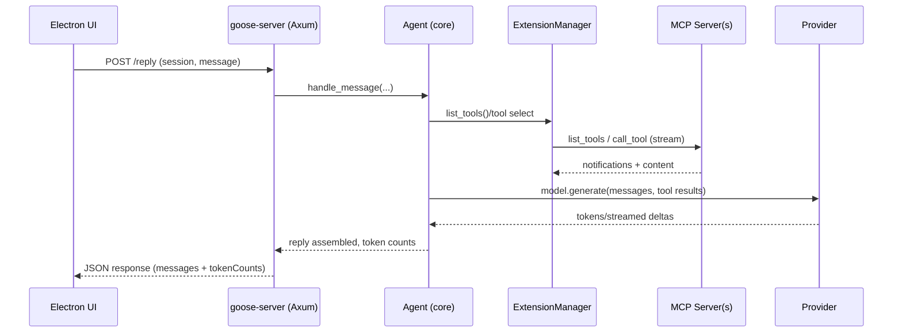
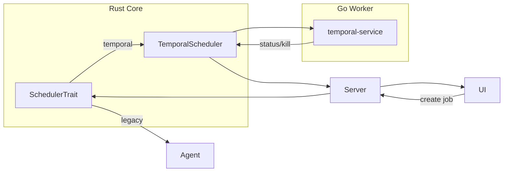

# Goose v1.12.00 Technical Architecture Report

Version analyzed: gooseV1.12.00
Scope: /goose-versions-references/gooseV1.12.00

## Executive summary
Goose is a Rust-first, multi-surface AI agent framework with three principal runtimes: a CLI, an HTTP server backing an Electron desktop app, and a Go-based scheduler that integrates with Temporal. The core crate (crates/goose) implements agent orchestration, provider abstraction for many LLMs, an extension system based on MCP (Model Context Protocol), session and scheduling subsystems, security/permissioning, and observability layers. The server crate (crates/goose-server) exposes agent/session/config/schedule routes over Axum with OpenAPI via Utoipa, and the UI (ui/desktop) is a React + Electron app bundling generated API clients from that OpenAPI. Extensions run via MCP over stdio/SSE/HTTP, including first-party developer/computer-controller/docx/xlsx/pdf/memory/tutorial servers in crates/goose-mcp. Data/control flow is: UI/CLI → goose-server (Axum) → core agent/session/scheduler → MCP tools/providers → outputs and telemetry (OTLP/Langfuse). Configuration uses a unified config layer with env overrides and system keyring when available; secrets are requested via setup flows or env. Scheduling supports a legacy in-process scheduler and a Temporal-backed mode using an accompanying Go service.

## Tech stack overview
- Languages
  - Rust (core, CLI, server, MCP extensions, benchmarking)
  - TypeScript/React (Electron desktop UI)
  - Go (Temporal scheduler service)
  - Bash/Python (tooling, scripts, tests/examples)
- Frameworks/libs (Rust)
  - Axum (HTTP), Utoipa (OpenAPI), Tokio (async), Tracing + OpenTelemetry (OTLP), Reqwest
  - rmcp (official MCP SDK), schemars/serde (schema/serde)
  - tower-http for CORS, etc.
- Frontend
  - Electron Forge + Vite, React 19, Playwright (e2e), Vitest (unit), Tailwind CSS
- Observability
  - OTLP exporter (custom layer), optional Langfuse batch sender
- CI/build
  - Cargo workspace; GitHub Actions workflows for CLI builds, desktop bundling, docker, tests

## Repository structure walkthrough
High-level tree (selected):
- crates/
  - goose: core library
    - agents/: agent loop, tool routing, extension manager, subagents, retry, prompts
    - providers/: multi-vendor LLM providers (OpenAI, Anthropic, Vertex, Bedrock, Azure, Ollama, etc.) with pricing/usage
    - conversation/: message types, tool request/response serde, reply assembly
    - session/: session store/manager, extension data, diagnostics
    - scheduler.rs + temporal_scheduler.rs + scheduler_trait.rs: scheduling abstraction and Temporal integration
    - config/: config files, extension config types, permission model, paths
    - security/: patterns, scanner, inspector
    - tracing/: otlp_layer, observation and langfuse layers, rate limiter
    - recipe/: recipe execution, templates, validators, deeplinks
    - oauth/: lightweight OAuth helpers (PKCE callback, persist)
  - goose-server: Axum server (aka goosed)
    - routes/: agent, reply, audio, sessions, schedules, recipes, extensions, config
    - openapi.rs: schema generation bridge to Utoipa; build.rs to regenerate
    - auth.rs: X-Secret-Key header middleware
    - ui/desktop/openapi.json reference
  - goose-cli: CLI entrypoint and commands
    - commands/: configure, web, session, schedule, recipe, project, acp
    - session/: builders, completion, I/O, export
    - recipes/: discovery and helpers
  - goose-mcp: first-party MCP servers
    - developer/: shell, text_editor, rmcp_developer, editor models
    - computercontroller/: PDF/DOCX/XLSX tools and system control wrappers
    - memory/: memory MCP server
    - tutorial/: tutorial MCP server
    - autovisualiser/: HTML template-based visualizations
  - goose-bench: benchmarking/eval harness
  - goose-test: test helpers
- temporal-service/: Go Temporal worker, workflows, activities, process mgmt
- ui/desktop/: Electron app (main, preload, renderer hooks, API client, recipes, scheduling)
- documentation/: Docusaurus docs and blog

## Core subsystems and responsibilities
- Agent orchestration (crates/goose/src/agents)
  - agent.rs: high-level reasoning loop, message ingestion, tool-call orchestration
  - extension_manager.rs: lifecycle and invocation of MCP extensions; tool discovery and prefixing; resource/prompt listing; tool dispatch with streaming notifications
  - router_tool_selector.rs/tool_router_index_manager.rs/router_tools.rs: LLM-based tool routing, index management
  - prompt_manager.rs/prompt_template.rs: system/role prompts and Jinja-like rendering
  - subagent_handler.rs/sub_recipe_manager.rs: spawn subagents or structured subrecipes
  - schedule_tool.rs: interface exposing scheduling as a tool
- Configuration (crates/goose/src/config)
  - base.rs: Config layer supporting get/set, env overrides, persistence to config paths
  - extensions.rs + declarative_providers.rs: defining extension/provider configs declaratively
  - permission.rs: permission model and levels used by server and agent
  - paths.rs: OS paths and application strategy
- Providers (crates/goose/src/providers)
  - Provider trait and implementations for OpenAI, Anthropic, VertexAI, Azure OpenAI, Bedrock, OpenRouter, Ollama, etc.
  - Pricing/usage estimation, retry, OAuth flows for some providers
  - lead_worker.rs implements lead/worker multi-model pattern
- Conversation and session
  - conversation/: message types, tool result serde, content variants (text, image, tool req/res)
  - session/: SessionManager, per-session state, extension data, diagnostics, token accounting
- Scheduling
  - scheduler.rs: legacy scheduler and normalization; scheduler_factory.rs; scheduler_trait.rs
  - temporal_scheduler.rs: external Temporal integration; process discovery and control of Go worker; job inspection/kill, port checks
- Security
  - security/patterns.rs and scanner.rs: prompt-injection/security scanning; security_inspector.rs implements a ToolInspector that reviews tool calls
  - permission/*: UI/server permission confirmation/judge and store
  - agents/extension_malware_check.rs: deny malicious stdio commands
- Observability (crates/goose/src/tracing)
  - otlp_layer.rs: configurable OTLP exporters for traces/metrics with env/config integration
  - observation_layer.rs: structured observation of sessions/messages/tools
  - langfuse_layer.rs: optional Langfuse batching
  - rate_limiter.rs: provider call rate limiting helpers
- Recipe engine (crates/goose/src/recipe)
  - template_recipe.rs, read_recipe_file_content.rs, validate_recipe.rs, local_recipes.rs
  - recipes are YAML/JSON-like instructions used by CLI and UI

## Control flow and data flow
- CLI flow: goose-cli main → cli::cli() parses args → commands/* invoke core goose APIs (session start, agent run, schedule create, recipe exec) → providers/extensions run → results streamed back to terminal or exported
- Server/UI flow: Electron renderer calls goosed over HTTP → Axum routes map to core APIs (session mgmt, agent replies, config updates, schedule ops) → responses serialized via Utoipa schema. UI regenerates TS client from OpenAPI during build.
- Tools and extensions: Agent asks ExtensionManager for tool list; names are prefixed by extension key (ext__tool). Tool calls dispatch to the corresponding MCP client over stdio/SSE/HTTP, optionally with OAuth bootstrap; streaming notifications are propagated back into the conversation.
- Scheduling: Jobs created via schedule routes or schedule tool. In temporal mode, Rust TemporalScheduler supervises the external Go service which runs Temporal workflows/activities; status/kill/inspect endpoints bridge back to UI.

Mermaid sequence (core UI → Server → Agent → MCP → Provider):


## Extension/Plugin model (tools, subagents, recipes)
- Protocol: Model Context Protocol via official rmcp crate; transports supported: stdio child processes, SSE servers, and HTTP with streamable client. Built-in and platform extensions are registered in PLATFORM_EXTENSIONS; third-party are configured via config files.
- Discovery: ExtensionManager aggregates tools from each connected MCP server, prefixed as "{extension}__{tool}" to avoid collisions; availability can be filtered per extension config.
- Invocation: Tool calls are routed to the owning MCP client; arguments are validated and results streamed back. Resource APIs (list/read) and prompt listing are supported. OAuth-required HTTP MCP servers use an oauth_flow helper to complete PKCE-like flows.
- Subagents and subrecipes: subagent_handler and sub_recipe_manager allow fan-out of tasks either as autonomous subagents or as structured recipe executions; integrated with scheduling when needed.

## Scheduling and background execution
- Legacy in-process scheduler: scheduler.rs implements cron parsing/normalization; schedule_tool exposes operations to the agent.
- Temporal-backed scheduling: temporal_scheduler.rs supervises a separate Go binary in temporal-service/ (main.go, goose_workflow.go, schedule.go). Rust launches/stops the process, inspects jobs, and communicates via well-defined ports and process control. The Go worker hosts Temporal workflows/activities for robust background job execution.

Mermaid component diagram (scheduling):


## Storage and configuration (env, secrets, state)
- Config: Config::new/global reads and persists user configuration under ~/.config/goose; parameters are retrievable by key and overridable with env vars (e.g., GOOSE_PROVIDER, GOOSE_MODEL, GOOSE_SCHEDULER_TYPE, OTEL_*).
- Secrets: Preferred storage is the OS keychain/keyring; in headless/container environments, env variables can be used. CLI "configure" guides users to set API keys and provider-specific models; server setup routes assist OpenRouter/Tetrate flows.
- Sessions/state: SessionManager maintains per-session message logs, extension data, token accounting; UI keeps a local cache for recent sessions. No external DB is required by default; persistence is largely file-based plus keychain.

## API/Interface surface (CLIs, HTTP, SDKs)
- CLI (crates/goose-cli)
  - commands: configure, session (start/continue/export), recipe (run/list), schedule (create/pause/kill/inspect), web (embedded static UI), acp/project/info/update
- HTTP Server (crates/goose-server)
  - Auth: X-Secret-Key header checked by middleware, /status unauthenticated
  - Routes: agent (reply, provider/model config), session CRUD and import/export, schedule manage/inspect, config and permissions, extension discovery
  - OpenAPI: Generated with utoipa and bridged types from core; UI consumes via openapi-ts to generate client
- MCP Servers (crates/goose-mcp)
  - Built-ins: developer (shell, text_editor, editor models), computercontroller (docx/xlsx/pdf tools, system control), memory, tutorial, autovisualiser

## Security considerations
- Tool safety: Permission model and inspectors gate sensitive tools; explicit allowlist support in server; extension_malware_check denies risky stdio invocations; security scanner detects prompt injection patterns.
- Authentication: Server requires X-Secret-Key for most endpoints. OAuth helper used for provider setup and HTTP MCP servers when required.
- Secrets handling: Prefer OS keychain; documented environment fallbacks. No secrets stored in Git.
- CORS: tower-http CorsLayer applied where needed for embedded web surfaces.

## Observability (logging, metrics, tracing)
- Tracing via tracing crate; OTLP exporter configurable via env or config (OTEL_EXPORTER_OTLP_*). Custom filters for traces and metrics.
- Optional Langfuse integration for event batching.
- Bench crate captures token usage and tool call counts for evals.

## Notable dependencies and integration points
- LLM providers: OpenAI, Anthropic, Vertex AI, Azure OpenAI, Bedrock, OpenRouter, Ollama, Claude Code, GitHub Copilot, etc.
- Protocols: MCP over stdio/SSE/HTTP; OAuth PKCE-like flows for certain integrations.
- Desktop: Electron Forge + Vite; OpenAPI-driven client codegen.
- Scheduling: Temporal via external Go worker supervised by Rust.

## Deployment and runtime model
- Local dev: cargo build/test; ui/desktop "start-gui" or just "run-ui" will build server OpenAPI then run Electron app; server can be run as `goose-server agent`.
- Desktop distributions: Electron Forge makers (deb/rpm/dmg/exe). UI bundles platform binaries via scripts/prepare-platform-binaries.js.
- Docker: example compose and Dockerfile under documentation/docs/docker for CLI usage.

## Testing strategy
- Rust: cargo tests across core crate including heavy agent/session/provider tests and MCP integration replays; clippy and fmt scripts in CI.
- UI: Vitest for unit, Playwright for e2e against dev server.
- Bench: reproducible eval suites and metrics aggregation scripts.

## Risks, gaps, and recommendations
- Process supervision of the Temporal Go worker increases operational surface; ensure robust lifecycle, port collision handling, and logs forwarding—much is present but consider health probes and backoff policies.
- Security model for tool execution is strong but relies on allowlists and inspectors; keep allowlist defaults strict and continue evolving static analysis (recipe-scanner) rules.
- Secrets/keyring portability is challenging on headless Linux; ensure env-based paths are well documented and surfaced in configure flows/UI.
- Provider sprawl warrants centralized rate-limiting, usage caps, and better error normalization; existing rate_limiter and retry can be extended with per-provider policies.

---

### Appendix A: Repository tree with brief annotations (selected)
```text
crates/
  goose/                 Core orchestration, providers, config, sessions, security, tracing, recipes
  goose-server/          Axum server exporting API backed by core; OpenAPI generation
  goose-cli/             CLI entry; commands wiring to core
  goose-mcp/             First-party MCP servers (developer, computercontroller, memory, tutorial, autovisualiser)
  goose-bench/           Benchmarks/evals and reporting
  goose-test/            Test harness/utilities
ui/desktop/              Electron app (main process, renderer, hooks, tests), OpenAPI client
temporal-service/        Go Temporal worker (workflows, activities, service mgmt)
documentation/           Docusaurus docs and blog
scripts/                 Lint, clippy, bench, openapi helpers
```
